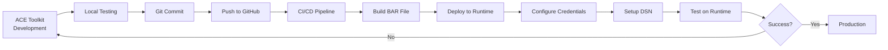

# ACE Development Workflow Guide
## Toolkit → GitHub → BAR Build → Runtime Deployment

**Version:** 1.0  
**Date:** June 10, 2026  
**Purpose:** Complete workflow for ACE development with source control and automated deployment

---

## Table of Contents

1. [Workflow Overview](#1-workflow-overview)
2. [Development Environment Setup](#2-development-environment-setup)
3. [ACE Toolkit Development](#3-ace-toolkit-development)
4. [Source Control with GitHub](#4-source-control-with-github)
5. [BAR File Build Process](#5-bar-file-build-process)
6. [Credential Management](#6-credential-management)
7. [Database Configuration](#7-database-configuration)
8. [Deployment to Runtime](#8-deployment-to-runtime)
9. [CI/CD Pipeline](#9-cicd-pipeline)
10. [Best Practices](#10-best-practices)

---

## 1. Workflow Overview

### 1.1 Complete Development Lifecycle



### 1.2 Key Components

| Component | Purpose | Location |
|-----------|---------|----------|
| **ACE Toolkit** | Development IDE | Developer workstation |
| **GitHub** | Source control | Cloud repository |
| **Build Server** | BAR file creation | CI/CD environment |
| **ACE Runtime** | Integration server | Runtime server |
| **Credentials** | Security config | Runtime server |
| **DSN** | Database connection | Runtime server |

---

## 2. Development Environment Setup

### 2.1 ACE Toolkit Installation

```bash
# Download ACE Toolkit from IBM
# Version: 12.0.x or later

# Installation directory (example)
/opt/IBM/ace-12.0.x/

# Set environment variables
export MQSI_BASE_FILEPATH=/opt/IBM/ace-12.0.x
export PATH=$MQSI_BASE_FILEPATH/server/bin:$PATH

# Verify installation
mqsiversion
```

### 2.2 Workspace Setup

```bash
# Create ACE workspace
mqsicreateworkdir /home/aceuser/ACE_Workspace

# Set workspace in Toolkit
# File → Switch Workspace → /home/aceuser/ACE_Workspace
```

### 2.3 Git Configuration

```bash
# Install Git
sudo apt-get install git

# Configure Git
git config --global user.name "Your Name"
git config --global user.email "your.email@company.com"

# Generate SSH key for GitHub
ssh-keygen -t ed25519 -C "your.email@company.com"

# Add SSH key to GitHub
cat ~/.ssh/id_ed25519.pub
# Copy and add to GitHub → Settings → SSH Keys
```

---

## 3. ACE Toolkit Development

### 3.1 Project Structure in Toolkit

```
ACE_Workspace/
├── Applications/
│   ├── CustomerOrderApp/
│   │   ├── Flows/
│   │   │   ├── CustomerOrderFlow.msgflow
│   │   │   ├── OrderValidationFlow.msgflow
│   │   │   └── OrderProcessingFlow.msgflow
│   │   ├── Subflows/
│   │   │   ├── DatabaseOperations.subflow
│   │   │   ├── ErrorHandling.subflow
│   │   │   └── Logging.subflow
│   │   ├── ESQL/
│   │   │   ├── CustomerValidation.esql
│   │   │   └── OrderTransformation.esql
│   │   └── Resources/
│   │       ├── schemas/
│   │       │   ├── Customer.xsd
│   │       │   └── Order.xsd
│   │       └── maps/
│   │           └── OrderMapping.map
│   └── InventoryApp/
│       └── ...
├── Libraries/
│   ├── CommonLibrary/
│   │   ├── Subflows/
│   │   │   ├── StandardLogging.subflow
│   │   │   ├── AuditTrail.subflow
│   │   │   └── DataValidation.subflow
│   │   └── ESQL/
│   │       └── CommonFunctions.esql
│   └── DatabaseLibrary/
│       └── ...
└── SharedResources/
    ├── Policies/
    │   ├── SecurityPolicy.policyxml
    │   └── HTTPSPolicy.policyxml
    └── Properties/
        ├── dev.properties
        ├── test.properties
        └── prod.properties
```

### 3.2 Creating a New Application

#### Step 1: Create Application in Toolkit
```
1. File → New → Application
2. Name: CustomerOrderApp
3. Create message flows, subflows, ESQL modules
```

#### Step 2: Create Message Flow with Database Node

**Example: CustomerOrderFlow.msgflow**

```
Flow Structure:
┌─────────────┐     ┌──────────────┐     ┌─────────────┐     ┌──────────────┐
│ HTTPInput   │────→│ Logging      │────→│ Validation  │────→│ Database     │
│ /api/orders │     │ Subflow      │     │ Subflow     │     │ Read Node    │
└─────────────┘     └──────────────┘     └─────────────┘     └──────────────┘
                                                                      │
                                                                      ↓
┌─────────────┐     ┌──────────────┐     ┌─────────────┐     ┌──────────────┐
│ HTTPReply   │←────│ Transform    │←────│ Database    │←────│ Business     │
│ Response    │     │ Response     │     │ Write Node  │     │ Logic        │
└─────────────┘     └──────────────┘     └─────────────┘     └──────────────┘
```

#### Step 3: Configure Database Node

**Database Read Node Properties:**
```
Data Source Name: CUSTOMER_DB_DSN
SQL Statement: SELECT * FROM CUSTOMERS WHERE customer_id = ?
Parameters: InputRoot.JSON.Data.customerId
Result Set: OutputRoot.Database.Results
```

**Database Write Node Properties:**
```
Data Source Name: ORDER_DB_DSN
SQL Statement: INSERT INTO ORDERS (order_id, customer_id, amount, status) VALUES (?, ?, ?, ?)
Parameters: 
  - InputRoot.JSON.Data.orderId
  - InputRoot.JSON.Data.customerId
  - InputRoot.JSON.Data.amount
  - 'PENDING'
```

### 3.3 Creating Subflows

**Example: DatabaseOperations.subflow**

```esql
-- ESQL Module: DatabaseOperations.esql

CREATE COMPUTE MODULE ReadCustomerData
    CREATE FUNCTION Main() RETURNS BOOLEAN
    BEGIN
        -- Set database connection
        SET OutputRoot.Properties.DSN = 'CUSTOMER_DB_DSN';
        
        -- Prepare SQL query
        DECLARE customerId CHARACTER InputRoot.JSON.Data.customerId;
        
        -- Execute query
        SET OutputRoot.Database.Results[] = 
            PASSTHRU('SELECT * FROM CUSTOMERS WHERE customer_id = ?', customerId);
        
        RETURN TRUE;
    END;
END MODULE;

CREATE COMPUTE MODULE WriteOrderData
    CREATE FUNCTION Main() RETURNS BOOLEAN
    BEGIN
        -- Set database connection
        SET OutputRoot.Properties.DSN = 'ORDER_DB_DSN';
        
        -- Prepare data
        DECLARE orderId CHARACTER InputRoot.JSON.Data.orderId;
        DECLARE customerId CHARACTER InputRoot.JSON.Data.customerId;
        DECLARE amount DECIMAL InputRoot.JSON.Data.amount;
        
        -- Execute insert
        PASSTHRU('INSERT INTO ORDERS (order_id, customer_id, amount, status) VALUES (?, ?, ?, ?)',
                 orderId, customerId, amount, 'PENDING');
        
        RETURN TRUE;
    END;
END MODULE;
```

### 3.4 Local Testing in Toolkit

```bash
# Start local integration server
mqsistart TEST_SERVER

# Deploy application for testing
mqsideploy TEST_SERVER -a /path/to/CustomerOrderApp.bar

# Test with curl
curl -X POST http://localhost:7800/api/orders \
  -H "Content-Type: application/json" \
  -d '{
    "orderId": "ORD001",
    "customerId": "CUST001",
    "amount": 1500.00
  }'

# View logs
tail -f /var/mqsi/components/TEST_SERVER/stdout
```

---

## 4. Source Control with GitHub

### 4.1 Initialize Git Repository

```bash
# Navigate to workspace
cd /home/aceuser/ACE_Workspace

# Initialize Git
git init

# Create .gitignore
cat > .gitignore << 'EOF'
# ACE Toolkit specific
.metadata/
.settings/
*.bak
*.log
*.trace

# Build artifacts
*.bar
*.generated.*

# IDE files
.project
.classpath

# OS files
.DS_Store
Thumbs.db

# Credentials (NEVER commit)
*.properties.local
*credentials*
*password*
EOF

# Add remote repository
git remote add origin git@github.com:your-org/ace-projects.git
```

### 4.2 Project Structure for Git

```
ace-projects/                          # Git repository root
├── README.md
├── .gitignore
├── applications/
│   ├── CustomerOrderApp/
│   │   ├── CustomerOrderFlow.msgflow
│   │   ├── OrderValidationFlow.msgflow
│   │   ├── DatabaseOperations.subflow
│   │   ├── CustomerValidation.esql
│   │   └── README.md
│   └── InventoryApp/
│       └── ...
├── libraries/
│   ├── CommonLibrary/
│   │   ├── StandardLogging.subflow
│   │   ├── ErrorHandling.subflow
│   │   └── CommonFunctions.esql
│   └── DatabaseLibrary/
│       └── ...
├── resources/
│   ├── schemas/
│   │   ├── Customer.xsd
│   │   └── Order.xsd
│   └── policies/
│       ├── SecurityPolicy.policyxml
│       └── HTTPSPolicy.policyxml
├── properties/
│   ├── dev.properties.template        # Template only
│   ├── test.properties.template
│   └── prod.properties.template
├── scripts/
│   ├── build-bar.sh
│   ├── deploy.sh
│   └── setup-credentials.sh
└── docs/
    ├── DEPLOYMENT.md
    └── CONFIGURATION.md
```

### 4.3 Commit and Push Changes

```bash
# Add files
git add applications/CustomerOrderApp/

# Commit with meaningful message
git commit -m "feat: Add CustomerOrderFlow with database integration

- Implemented order validation logic
- Added database read/write operations
- Created error handling subflow
- Added unit tests

Refs: JIRA-123"

# Push to GitHub
git push origin main

# Create feature branch for new development
git checkout -b feature/inventory-integration
git push -u origin feature/inventory-integration
```

### 4.4 Branch Strategy

```
main (production-ready code)
├── develop (integration branch)
│   ├── feature/customer-validation
│   ├── feature/order-processing
│   └── feature/inventory-integration
├── release/v1.0.0
└── hotfix/critical-bug-fix
```

---

## 5. BAR File Build Process

### 5.1 Manual BAR Build (Toolkit)

```
1. Right-click on Application → New → BAR file
2. Name: CustomerOrderApp_v1.0.0.bar
3. Select resources to include:
   ✓ CustomerOrderFlow.msgflow
   ✓ OrderValidationFlow.msgflow
   ✓ DatabaseOperations.subflow
   ✓ All ESQL modules
   ✓ Schemas and maps
   ✓ Referenced libraries
4. Build → Build BAR
5. Save to: /home/aceuser/bars/CustomerOrderApp_v1.0.0.bar
```

### 5.2 Command-Line BAR Build

**Build Script: `scripts/build-bar.sh`**

```bash
#!/bin/bash
# Build BAR file from command line

# Configuration
WORKSPACE="/home/aceuser/ACE_Workspace"
APP_NAME="CustomerOrderApp"
VERSION="1.0.0"
BAR_NAME="${APP_NAME}_v${VERSION}.bar"
OUTPUT_DIR="/home/aceuser/bars"

# Create output directory
mkdir -p $OUTPUT_DIR

# Build BAR file
mqsicreatebar \
  -data $WORKSPACE \
  -b $OUTPUT_DIR/$BAR_NAME \
  -a $APP_NAME \
  -deployAsSource \
  -trace

# Verify BAR file
if [ -f "$OUTPUT_DIR/$BAR_NAME" ]; then
    echo "✓ BAR file created successfully: $OUTPUT_DIR/$BAR_NAME"
    
    # List contents
    mqsireadbar -b $OUTPUT_DIR/$BAR_NAME
    
    # Get file size
    ls -lh $OUTPUT_DIR/$BAR_NAME
else
    echo "✗ BAR file creation failed"
    exit 1
fi
```

**Usage:**
```bash
chmod +x scripts/build-bar.sh
./scripts/build-bar.sh
```

### 5.3 BAR File with Properties

**Build with environment-specific properties:**

```bash
#!/bin/bash
# Build BAR with properties override

ENVIRONMENT=$1  # dev, test, prod
WORKSPACE="/home/aceuser/ACE_Workspace"
APP_NAME="CustomerOrderApp"
VERSION="1.0.0"
BAR_NAME="${APP_NAME}_${ENVIRONMENT}_v${VERSION}.bar"
OUTPUT_DIR="/home/aceuser/bars"

# Build base BAR
mqsicreatebar \
  -data $WORKSPACE \
  -b $OUTPUT_DIR/$BAR_NAME \
  -a $APP_NAME

# Apply properties
mqsiapplybaroverride \
  -b $OUTPUT_DIR/$BAR_NAME \
  -p properties/${ENVIRONMENT}.properties \
  -o $OUTPUT_DIR/${BAR_NAME}

echo "✓ BAR file created with $ENVIRONMENT properties"
```

**Properties File: `properties/dev.properties`**

```properties
# Database Configuration
CustomerOrderApp#DatabaseOperations.subflow#CUSTOMER_DB_DSN=CUSTOMER_DB_DEV
CustomerOrderApp#DatabaseOperations.subflow#ORDER_DB_DSN=ORDER_DB_DEV

# HTTP Listener
CustomerOrderApp#CustomerOrderFlow.msgflow#HTTPInput.port=7800

# Logging
CustomerOrderApp#Logging.subflow#logLevel=DEBUG

# Timeouts
CustomerOrderApp#timeout=30
```

---

## 6. Credential Management

### 6.1 ACE Security Credentials

**Types of Credentials:**
1. **Database credentials** (username/password)
2. **API credentials** (tokens, keys)
3. **MQ credentials** (queue manager)
4. **HTTPS certificates**

### 6.2 Creating Credentials on Runtime Server

**Script: `scripts/setup-credentials.sh`**

```bash
#!/bin/bash
# Setup ACE credentials on runtime server

INTEGRATION_NODE="ACE_NODE"
INTEGRATION_SERVER="ACE_SERVER"

# 1. Create setdbparms for database
mqsisetdbparms $INTEGRATION_NODE \
  -n jdbc::CUSTOMER_DB \
  -u db_user \
  -p db_password

mqsisetdbparms $INTEGRATION_NODE \
  -n jdbc::ORDER_DB \
  -u db_user \
  -p db_password

# 2. Create setdbparms for HTTP Basic Auth
mqsisetdbparms $INTEGRATION_NODE \
  -n http::api_credentials \
  -u api_user \
  -p api_password

# 3. Create setdbparms for MQ
mqsisetdbparms $INTEGRATION_NODE \
  -n mq::QM1 \
  -u mquser \
  -p mqpassword

# 4. Verify credentials
mqsireportdbparms $INTEGRATION_NODE -n jdbc::*

echo "✓ Credentials configured successfully"
```

### 6.3 Using Credentials in Flows

**In Database Node:**
```
Data Source Name: CUSTOMER_DB
Security Identity: jdbc::CUSTOMER_DB
```

**In ESQL:**
```esql
CREATE COMPUTE MODULE UseCredentials
    CREATE FUNCTION Main() RETURNS BOOLEAN
    BEGIN
        -- Database credentials are automatically used
        -- when DSN is configured with security identity
        
        SET OutputRoot.Database.Results[] = 
            PASSTHRU('SELECT * FROM CUSTOMERS WHERE id = ?', 
                     InputRoot.JSON.Data.customerId);
        
        RETURN TRUE;
    END;
END MODULE;
```

### 6.4 Credential Security Best Practices

```bash
# 1. Never commit credentials to Git
echo "*credentials*" >> .gitignore
echo "*.password" >> .gitignore

# 2. Use environment variables
export DB_USER=$(vault read -field=username secret/database/customer)
export DB_PASS=$(vault read -field=password secret/database/customer)

# 3. Rotate credentials regularly
# 4. Use separate credentials per environment
# 5. Implement least privilege access
```

---

## 7. Database Configuration

### 7.1 ODBC DSN Setup on Runtime Server

**For Linux:**

```bash
# Install ODBC driver
sudo apt-get install unixodbc unixodbc-dev

# Install database-specific driver (PostgreSQL example)
sudo apt-get install odbc-postgresql

# Configure ODBC
sudo nano /etc/odbc.ini
```

**ODBC Configuration: `/etc/odbc.ini`**

```ini
[CUSTOMER_DB_DEV]
Description = Customer Database - Development
Driver = PostgreSQL
Server = dev-db-server.company.com
Port = 5432
Database = customer_db
Username = ace_user
Password = 
Trace = No
TraceFile = /tmp/odbc.log

[CUSTOMER_DB_TEST]
Description = Customer Database - Test
Driver = PostgreSQL
Server = test-db-server.company.com
Port = 5432
Database = customer_db
Username = ace_user
Password = 
Trace = No

[CUSTOMER_DB_PROD]
Description = Customer Database - Production
Driver = PostgreSQL
Server = prod-db-server.company.com
Port = 5432
Database = customer_db
Username = ace_user
Password = 
Trace = No

[ORDER_DB_DEV]
Description = Order Database - Development
Driver = PostgreSQL
Server = dev-db-server.company.com
Port = 5432
Database = order_db
Username = ace_user
Password = 
Trace = No
```

**ODBC Driver Configuration: `/etc/odbcinst.ini`**

```ini
[PostgreSQL]
Description = PostgreSQL ODBC Driver
Driver = /usr/lib/x86_64-linux-gnu/odbc/psqlodbcw.so
Setup = /usr/lib/x86_64-linux-gnu/odbc/libodbcpsqlS.so
FileUsage = 1
```

### 7.2 Test ODBC Connection

```bash
# Test DSN connection
isql -v CUSTOMER_DB_DEV ace_user password

# If successful, you'll see:
+---------------------------------------+
| Connected!                            |
|                                       |
| sql-statement                         |
| help [tablename]                      |
| quit                                  |
|                                       |
+---------------------------------------+

# Test query
SQL> SELECT COUNT(*) FROM CUSTOMERS;
SQL> quit
```

### 7.3 Configure DSN in ACE

**Option 1: Using mqsisetdbparms (Recommended)**

```bash
# Set DSN with credentials
mqsisetdbparms ACE_NODE \
  -n odbc::CUSTOMER_DB_DEV \
  -u ace_user \
  -p password

# Verify
mqsireportdbparms ACE_NODE -n odbc::*
```

**Option 2: Using server.conf.yaml**

```yaml
# /var/mqsi/config/ACE_NODE/ACE_SERVER/server.conf.yaml

ResourceManagers:
  JDBCProviders:
    CUSTOMER_DB:
      type: 'jdbcProviderXA'
      databaseType: 'PostgreSQL'
      databaseName: 'customer_db'
      serverName: 'dev-db-server.company.com'
      portNumber: 5432
      jarsURL: '/opt/jdbc-drivers/postgresql-42.5.0.jar'
      
  ODBCProviders:
    CUSTOMER_DB_DSN:
      type: 'odbcProvider'
      dsnName: 'CUSTOMER_DB_DEV'
```

### 7.4 Database Connection Pooling

```yaml
# server.conf.yaml - Connection pool configuration

ResourceManagers:
  JDBCProviders:
    CUSTOMER_DB:
      connectionPooling: true
      maxPoolSize: 50
      minPoolSize: 10
      connectionTimeout: 30
      idleTimeout: 600
      maxLifetime: 1800
```

---

## 8. Deployment to Runtime

### 8.1 Runtime Server Setup

```bash
# Create integration node
mqsicreatebroker ACE_NODE

# Start integration node
mqsistart ACE_NODE

# Create integration server
mqsicreateexecutiongroup ACE_NODE -e ACE_SERVER

# Verify
mqsilist
# Output:
# BIP1286I: Integration node 'ACE_NODE' with administration URI 'http://localhost:4414' is running.
# BIP1325I: Integration server 'ACE_SERVER' is running.
```

### 8.2 Deploy BAR File

**Manual Deployment:**

```bash
# Deploy BAR file
mqsideploy ACE_NODE \
  -e ACE_SERVER \
  -a /home/aceuser/bars/CustomerOrderApp_v1.0.0.bar \
  -w 120

# Verify deployment
mqsilist ACE_NODE -e ACE_SERVER -d 2

# Check deployed applications
mqsireportproperties ACE_NODE -e ACE_SERVER -o AllMessageFlows -r
```

**Deployment Script: `scripts/deploy.sh`**

```bash
#!/bin/bash
# Automated deployment script

# Configuration
INTEGRATION_NODE="ACE_NODE"
INTEGRATION_SERVER="ACE_SERVER"
BAR_FILE=$1
ENVIRONMENT=$2

if [ -z "$BAR_FILE" ] || [ -z "$ENVIRONMENT" ]; then
    echo "Usage: ./deploy.sh <bar_file> <environment>"
    echo "Example: ./deploy.sh CustomerOrderApp_v1.0.0.bar dev"
    exit 1
fi

echo "========================================="
echo "Deploying to $ENVIRONMENT environment"
echo "========================================="

# 1. Backup current deployment
echo "1. Creating backup..."
BACKUP_DIR="/home/aceuser/backups/$(date +%Y%m%d_%H%M%S)"
mkdir -p $BACKUP_DIR
mqsibackupbroker $INTEGRATION_NODE -d $BACKUP_DIR

# 2. Stop message flows (optional, for zero-downtime)
echo "2. Stopping message flows..."
mqsistopmsgflow $INTEGRATION_NODE -e $INTEGRATION_SERVER -k ALL

# 3. Deploy new BAR file
echo "3. Deploying BAR file..."
mqsideploy $INTEGRATION_NODE \
  -e $INTEGRATION_SERVER \
  -a $BAR_FILE \
  -w 120

# 4. Verify deployment
echo "4. Verifying deployment..."
if mqsilist $INTEGRATION_NODE -e $INTEGRATION_SERVER -d 2 | grep -q "CustomerOrderApp"; then
    echo "✓ Deployment successful"
else
    echo "✗ Deployment failed"
    echo "Rolling back..."
    mqsirestorebroker $INTEGRATION_NODE -d $BACKUP_DIR
    exit 1
fi

# 5. Start message flows
echo "5. Starting message flows..."
mqsistartmsgflow $INTEGRATION_NODE -e $INTEGRATION_SERVER -k ALL

# 6. Health check
echo "6. Running health check..."
sleep 5
curl -f http://localhost:7800/health || {
    echo "✗ Health check failed"
    exit 1
}

echo "========================================="
echo "✓ Deployment completed successfully"
echo "========================================="
```

### 8.3 Zero-Downtime Deployment

```bash
#!/bin/bash
# Blue-Green deployment strategy

INTEGRATION_NODE="ACE_NODE"
BLUE_SERVER="ACE_SERVER_BLUE"
GREEN_SERVER="ACE_SERVER_GREEN"
BAR_FILE=$1

# Determine active server
ACTIVE_SERVER=$(mqsilist $INTEGRATION_NODE | grep "is running" | head -1 | awk '{print $4}' | tr -d "'")

if [ "$ACTIVE_SERVER" == "$BLUE_SERVER" ]; then
    INACTIVE_SERVER=$GREEN_SERVER
else
    INACTIVE_SERVER=$BLUE_SERVER
fi

echo "Active: $ACTIVE_SERVER, Deploying to: $INACTIVE_SERVER"

# 1. Deploy to inactive server
mqsideploy $INTEGRATION_NODE -e $INACTIVE_SERVER -a $BAR_FILE

# 2. Verify deployment
sleep 10
curl -f http://localhost:7801/health || exit 1

# 3. Switch traffic (update load balancer)
echo "Switch load balancer from $ACTIVE_SERVER to $INACTIVE_SERVER"

# 4. Stop old server
mqsistopexecutiongroup $INTEGRATION_NODE -e $ACTIVE_SERVER

echo "✓ Zero-downtime deployment completed"
```

### 8.4 Rollback Procedure

```bash
#!/bin/bash
# Rollback to previous version

INTEGRATION_NODE="ACE_NODE"
INTEGRATION_SERVER="ACE_SERVER"
BACKUP_DIR=$1

if [ -z "$BACKUP_DIR" ]; then
    echo "Usage: ./rollback.sh <backup_directory>"
    exit 1
fi

echo "Rolling back to backup: $BACKUP_DIR"

# 1. Stop current flows
mqsistopmsgflow $INTEGRATION_NODE -e $INTEGRATION_SERVER -k ALL

# 2. Restore from backup
mqsirestorebroker $INTEGRATION_NODE -d $BACKUP_DIR

# 3. Start flows
mqsistartmsgflow $INTEGRATION_NODE -e $INTEGRATION_SERVER -k ALL

# 4. Verify
curl -f http://localhost:7800/health

echo "✓ Rollback completed"
```

---

## 9. CI/CD Pipeline

### 9.1 GitHub Actions Workflow

**`.github/workflows/ace-cicd.yml`**

```yaml
name: ACE CI/CD Pipeline

on:
  push:
    branches: [ main, develop ]
  pull_request:
    branches: [ main ]

env:
  ACE_VERSION: '12.0.9.0'
  WORKSPACE_DIR: ${{ github.workspace }}/ace-workspace

jobs:
  build:
    runs-on: ubuntu-latest
    
    steps:
    - name: Checkout code
      uses: actions/checkout@v3
    
    - name: Setup ACE Toolkit
      run: |
        # Download and install ACE
        wget https://public.dhe.ibm.com/ibmdl/export/pub/software/websphere/integration/12.0.9.0-ACE-LINUX64-DEVELOPER.tar.gz
        tar -xzf 12.0.9.0-ACE-LINUX64-DEVELOPER.tar.gz
        export PATH=$PWD/ace-12.0.9.0/server/bin:$PATH
        mqsiversion
    
    - name: Create workspace
      run: |
        mqsicreateworkdir $WORKSPACE_DIR
        cp -r applications/* $WORKSPACE_DIR/
        cp -r libraries/* $WORKSPACE_DIR/
    
    - name: Build BAR file
      run: |
        mqsicreatebar \
          -data $WORKSPACE_DIR \
          -b CustomerOrderApp.bar \
          -a CustomerOrderApp \
          -deployAsSource
    
    - name: Run tests
      run: |
        # Run ACE unit tests
        mqsitest -d $WORKSPACE_DIR -a CustomerOrderApp
    
    - name: Upload BAR artifact
      uses: actions/upload-artifact@v3
      with:
        name: bar-file
        path: CustomerOrderApp.bar
  
  deploy-dev:
    needs: build
    runs-on: ubuntu-latest
    if: github.ref == 'refs/heads/develop'
    
    steps:
    - name: Download BAR artifact
      uses: actions/download-artifact@v3
      with:
        name: bar-file
    
    - name: Deploy to DEV
      env:
        ACE_SERVER: ${{ secrets.ACE_DEV_SERVER }}
        ACE_USER: ${{ secrets.ACE_DEV_USER }}
        ACE_PASSWORD: ${{ secrets.ACE_DEV_PASSWORD }}
      run: |
        # Deploy via SSH
        sshpass -p "$ACE_PASSWORD" scp CustomerOrderApp.bar $ACE_USER@$ACE_SERVER:/tmp/
        sshpass -p "$ACE_PASSWORD" ssh $ACE_USER@$ACE_SERVER \
          "mqsideploy ACE_NODE -e ACE_SERVER_DEV -a /tmp/CustomerOrderApp.bar"
    
    - name: Run smoke tests
      run: |
        curl -f http://dev-server:7800/health
        curl -X POST http://dev-server:7800/api/orders \
          -H "Content-Type: application/json" \
          -d '{"orderId":"TEST001","customerId":"CUST001","amount":100}'
  
  deploy-prod:
    needs: build
    runs-on: ubuntu-latest
    if: github.ref == 'refs/heads/main'
    environment: production
    
    steps:
    - name: Download BAR artifact
      uses: actions/download-artifact@v3
      with:
        name: bar-file
    
    - name: Deploy to PROD
      env:
        ACE_SERVER: ${{ secrets.ACE_PROD_SERVER }}
        ACE_USER: ${{ secrets.ACE_PROD_USER }}
        ACE_PASSWORD: ${{ secrets.ACE_PROD_PASSWORD }}
      run: |
        # Blue-Green deployment
        sshpass -p "$ACE_PASSWORD" scp CustomerOrderApp.bar $ACE_USER@$ACE_SERVER:/tmp/
        sshpass -p "$ACE_PASSWORD" ssh $ACE_USER@$ACE_SERVER \
          "/opt/scripts/blue-green-deploy.sh /tmp/CustomerOrderApp.bar"
    
    - name: Health check
      run: |
        sleep 30
        curl -f https://api.company.com/health
    
    - name: Notify team
      uses: 8398a7/action-slack@v3
      with:
        status: ${{ job.status }}
        text: 'Production deployment completed'
        webhook_url: ${{ secrets.SLACK_WEBHOOK }}
```

### 9.2 Jenkins Pipeline

**`Jenkinsfile`**

```groovy
pipeline {
    agent any
    
    environment {
        ACE_HOME = '/opt/IBM/ace-12.0'
        WORKSPACE_DIR = "${WORKSPACE}/ace-workspace"
        BAR_FILE = "CustomerOrderApp_${BUILD_NUMBER}.bar"
    }
    
    stages {
        stage('Checkout') {
            steps {
                checkout scm
            }
        }
        
        stage('Build') {
            steps {
                sh '''
                    export PATH=$ACE_HOME/server/bin:$PATH
                    mqsicreateworkdir $WORKSPACE_DIR
                    cp -r applications/* $WORKSPACE_DIR/
                    cp -r libraries/* $WORKSPACE_DIR/
                    
                    mqsicreatebar \
                        -data $WORKSPACE_DIR \
                        -b $BAR_FILE \
                        -a CustomerOrderApp \
                        -deployAsSource
                '''
            }
        }
        
        stage('Test') {
            steps {
                sh '''
                    export PATH=$ACE_HOME/server/bin:$PATH
                    mqsitest -d $WORKSPACE_DIR -a CustomerOrderApp
                '''
            }
        }
        
        stage('Deploy to DEV') {
            when {
                branch 'develop'
            }
            steps {
                sh '''
                    scp $BAR_FILE aceuser@dev-server:/tmp/
                    ssh aceuser@dev-server "mqsideploy ACE_NODE -e ACE_SERVER_DEV -a /tmp/$BAR_FILE"
                '''
            }
        }
        
        stage('Deploy to PROD') {
            when {
                branch 'main'
            }
            steps {
                input message: 'Deploy to production?', ok: 'Deploy'
                
                sh '''
                    scp $BAR_FILE aceuser@prod-server:/tmp/
                    ssh aceuser@prod-server "/opt/scripts/deploy.sh /tmp/$BAR_FILE prod"
                '''
            }
        }
    }
    
    post {
        success {
            archiveArtifacts artifacts: '*.bar', fingerprint: true
            emailext (
                subject: "Build Success: ${env.JOB_NAME} - ${env.BUILD_NUMBER}",
                body: "Build completed successfully",
                to: "team@company.com"
            )
        }
        failure {
            emailext (
                subject: "Build Failed: ${env.JOB_NAME} - ${env.BUILD_NUMBER}",
                body: "Build failed. Check console output.",
                to: "team@company.com"
            )
        }
    }
}
```

---

## 10. Best Practices

### 10.1 Development Best Practices

✅ **DO:**
- Use meaningful names for flows and subflows
- Create reusable subflows for common operations
- Implement proper error handling in all flows
- Add logging at key points
- Use properties files for configuration
- Write unit tests for ESQL modules
- Document complex logic
- Use version control for all artifacts

❌ **DON'T:**
- Hardcode credentials in flows
- Commit BAR files to Git
- Skip testing before deployment
- Deploy directly to production
- Ignore error handling
- Use production credentials in development

### 10.2 Source Control Best Practices

```bash
# Good commit message
git commit -m "feat: Add customer validation with database lookup

- Implemented customer ID validation
- Added database query for customer verification
- Created error handling for invalid customers
- Added unit tests

Refs: JIRA-456"

# Bad commit message
git commit -m "fixed stuff"
```

### 10.3 Deployment Checklist

**Pre-Deployment:**
- [ ] Code reviewed and approved
- [ ] Unit tests passed
- [ ] Integration tests passed
- [ ] BAR file built successfully
- [ ] Properties configured for target environment
- [ ] Credentials configured on runtime server
- [ ] DSN configured and tested
- [ ] Backup created
- [ ] Rollback plan documented
- [ ] Stakeholders notified

**Post-Deployment:**
- [ ] Health check passed
- [ ] Smoke tests passed
- [ ] Logs reviewed for errors
- [ ] Performance metrics normal
- [ ] Database connections working
- [ ] End-to-end test passed
- [ ] Documentation updated
- [ ] Team notified

### 10.4 Security Best Practices

```bash
# 1. Separate credentials per environment
mqsisetdbparms ACE_NODE -n jdbc::CUSTOMER_DB_DEV -u dev_user -p dev_pass
mqsisetdbparms ACE_NODE -n jdbc::CUSTOMER_DB_PROD -u prod_user -p prod_pass

# 2. Use encrypted properties
mqsiencryptproperties -b CustomerOrderApp.bar -p properties/prod.properties

# 3. Rotate credentials regularly
# 4. Use least privilege database accounts
# 5. Enable SSL/TLS for database connections
# 6. Audit access to runtime servers
# 7. Monitor for suspicious activity
```

### 10.5 Monitoring and Logging

```bash
# Enable detailed logging
mqsichangeproperties ACE_NODE -e ACE_SERVER \
  -o ComIbmJVMManager -n traceLevel -v debug

# View logs
tail -f /var/mqsi/components/ACE_NODE/ACE_SERVER/stdout
tail -f /var/mqsi/components/ACE_NODE/ACE_SERVER/stderr

# Monitor message flow statistics
mqsireportflowstats ACE_NODE -e ACE_SERVER -s

# Monitor resource usage
mqsireportresourceusage ACE_NODE -e ACE_SERVER
```

---

## Appendix A: Quick Reference Commands

### ACE Toolkit Commands
```bash
# Create workspace
mqsicreateworkdir /path/to/workspace

# Build BAR file
mqsicreatebar -data /workspace -b app.bar -a AppName

# Apply properties
mqsiapplybaroverride -b app.bar -p dev.properties -o app_dev.bar

# Read BAR contents
mqsireadbar -b app.bar
```

### Runtime Commands
```bash
# Node management
mqsicreatebroker NODE_NAME
mqsistart NODE_NAME
mqsistop NODE_NAME
mqsidelete NODE_NAME

# Server management
mqsicreateexecutiongroup NODE_NAME -e SERVER_NAME
mqsistartexecutiongroup NODE_NAME -e SERVER_NAME
mqsistopexecutiongroup NODE_NAME -e SERVER_NAME

# Deployment
mqsideploy NODE_NAME -e SERVER_NAME -a app.bar

# Credentials
mqsisetdbparms NODE_NAME -n resource::name -u user -p pass
mqsireportdbparms NODE_NAME -n resource::*

# Monitoring
mqsilist NODE_NAME
mqsireportproperties NODE_NAME -e SERVER_NAME -o AllMessageFlows
mqsireportflowstats NODE_NAME -e SERVER_NAME
```

### Git Commands
```bash
# Basic workflow
git add .
git commit -m "message"
git push origin main

# Branching
git checkout -b feature/new-feature
git merge feature/new-feature
git branch -d feature/new-feature

# Tagging releases
git tag -a v1.0.0 -m "Release version 1.0.0"
git push origin v1.0.0
```

---

## Appendix B: Troubleshooting

### Common Issues

**Issue: BAR deployment fails**
```bash
# Check logs
tail -f /var/mqsi/components/ACE_NODE/ACE_SERVER/stderr

# Verify BAR file
mqsireadbar -b app.bar

# Check server status
mqsilist ACE_NODE -e ACE_SERVER
```

**Issue: Database connection fails**
```bash
# Test ODBC connection
isql -v DSN_NAME username password

# Check credentials
mqsireportdbparms ACE_NODE -n jdbc::*

# Verify DSN configuration
cat /etc/odbc.ini
```

**Issue: Flow not receiving messages**
```bash
# Check if flow is running
mqsireportproperties ACE_NODE -e ACE_SERVER -o AllMessageFlows -r

# Start flow
mqsistartmsgflow ACE_NODE -e ACE_SERVER -m APP_NAME -f FLOW_NAME

# Check port binding
netstat -an | grep 7800
```

---

**End of Document**

For questions or support, contact: ace-support@company.com