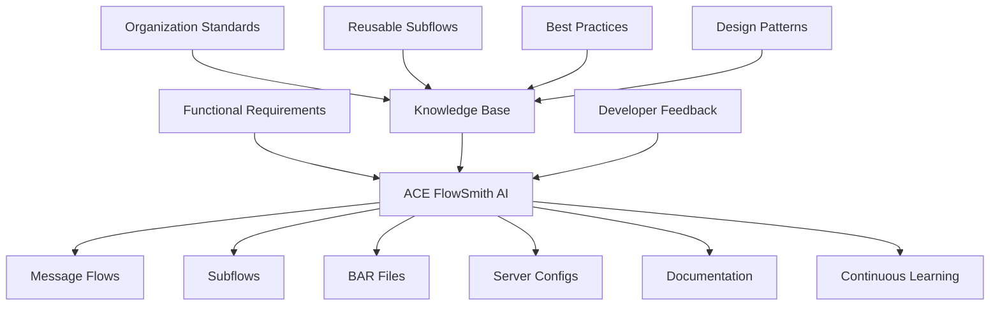
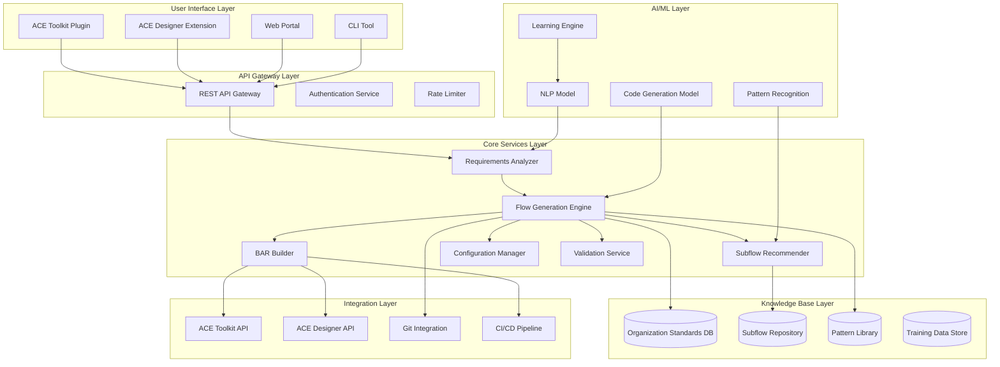
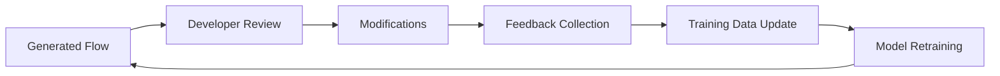
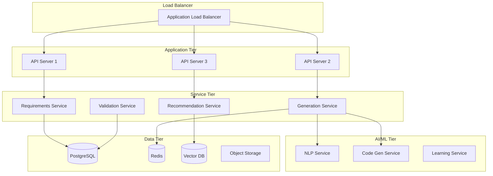

# ACE FlowSmith AI - Architecture Design Document & Technical Specification

**Version:** 1.0  
**Date:** June 10, 2026  
**Status:** Draft  
**Document Owner:** Enterprise Architecture Team

---

## Table of Contents

1. [Executive Summary](#1-executive-summary)
2. [Business Case & Market Opportunity](#2-business-case--market-opportunity)
3. [System Overview](#3-system-overview)
4. [High-Level Architecture](#4-high-level-architecture)
5. [Core Components](#5-core-components)
6. [Data Models & Schemas](#6-data-models--schemas)
7. [AI/ML Architecture](#7-aiml-architecture)
8. [Integration Architecture](#8-integration-architecture)
9. [Security Architecture](#9-security-architecture)
10. [API Specifications](#10-api-specifications)
11. [Deployment Architecture](#11-deployment-architecture)
12. [Non-Functional Requirements](#12-non-functional-requirements)
13. [Technology Stack](#13-technology-stack)
14. [Implementation Roadmap](#14-implementation-roadmap)
15. [Risk Assessment & Mitigation](#15-risk-assessment--mitigation)

---

## 1. Executive Summary

### 1.1 Purpose
ACE FlowSmith AI is an intelligent agent designed to revolutionize IBM App Connect Enterprise (ACE) development by automating the creation of message flows, subflows, and deployment artifacts while ensuring compliance with enterprise standards.

### 1.2 Problem Statement
Large enterprises running hundreds of ACE integrations face critical challenges:
- **Productivity Bottleneck**: New developers require 3-4 weeks of onboarding to understand organization-specific ACE practices
- **Manual Discovery**: Reusable subflows exist but are discovered manually, leading to duplication and inconsistency
- **Governance Gaps**: Maintaining compliance with enterprise standards across multiple teams is difficult
- **Delivery Pressure**: Increasing demand for faster integration delivery without compromising quality

### 1.3 Solution Overview
ACE FlowSmith AI addresses these challenges through:
- **Intelligent Code Generation**: Auto-generates message flows and subflows from functional requirements
- **Organization Learning**: Learns and enforces company-specific standards, patterns, and policies
- **Automated Deployment**: Generates BAR files, server configurations, and environment-specific parameters
- **Developer Augmentation**: Developers act as reviewers, validating and fine-tuning AI-generated flows
- **Continuous Improvement**: Learns from developer feedback to improve generation quality

### 1.4 Key Benefits
- **80% Reduction** in integration development time
- **90% Reduction** in onboarding time for new developers
- **100% Compliance** with enterprise standards and governance policies
- **60% Reduction** in production defects through standardized patterns
- **50% Increase** in reusability of integration components

---

## 2. Business Case & Market Opportunity

### 2.1 Market Opportunity
- **Target Market**: Large enterprises with 100+ ACE integrations
- **Market Size**: 5,000+ enterprises globally using IBM ACE
- **Pain Points**: Manual development, inconsistent standards, long onboarding cycles
- **Competitive Advantage**: First AI-powered ACE development assistant

### 2.2 ROI Analysis

#### Cost Savings (Per Year for 50 Developers)
| Category | Current Cost | With ACE FlowSmith AI | Savings |
|----------|--------------|----------------------|---------|
| Development Time | $5,000,000 | $1,000,000 | $4,000,000 |
| Onboarding | $500,000 | $50,000 | $450,000 |
| Defect Resolution | $750,000 | $300,000 | $450,000 |
| Governance Overhead | $300,000 | $100,000 | $200,000 |
| **Total Annual Savings** | | | **$5,100,000** |

#### Investment Required
- Development: $800,000
- Infrastructure: $100,000/year
- Training & Support: $50,000
- **Total First Year**: $950,000
- **ROI**: 437% in Year 1

### 2.3 Use Cases

#### Primary Use Cases
1. **New Integration Development**: Generate complete flows from requirements
2. **Subflow Reuse**: Discover and integrate existing subflows automatically
3. **Standard Enforcement**: Ensure all flows comply with enterprise standards
4. **Rapid Prototyping**: Create POCs in minutes instead of days
5. **Legacy Modernization**: Refactor old flows to new standards

#### Secondary Use Cases
6. **Documentation Generation**: Auto-generate flow documentation
7. **Test Case Creation**: Generate test scenarios from flows
8. **Performance Optimization**: Suggest optimizations based on patterns
9. **Security Hardening**: Apply security best practices automatically
10. **Compliance Reporting**: Generate compliance reports for audits

---

## 3. System Overview

### 3.1 Vision
Transform ACE development from manual coding to AI-assisted generation, where developers focus on business logic and validation rather than boilerplate code.

### 3.2 Core Capabilities



### 3.3 System Boundaries

#### In Scope
- Message flow generation from requirements
- Subflow creation and reuse
- BAR file generation
- Server configuration automation
- Environment-specific parameter management
- Developer review workflow
- Continuous learning from feedback

#### Out of Scope (Phase 1)
- Runtime monitoring and management
- Production deployment execution
- ACE server administration
- Network infrastructure management
- Third-party system integration (beyond ACE)

---

## 4. High-Level Architecture

### 4.1 Architecture Diagram



### 4.2 Architecture Principles

1. **Microservices Architecture**: Loosely coupled, independently deployable services
2. **API-First Design**: All functionality exposed through well-defined APIs
3. **Cloud-Native**: Containerized, scalable, and cloud-agnostic
4. **Security by Design**: Security integrated at every layer
5. **Event-Driven**: Asynchronous processing for scalability
6. **Data-Driven**: Continuous learning from usage patterns
7. **Extensible**: Plugin architecture for custom extensions

### 4.3 Architectural Patterns

- **CQRS**: Separate read and write operations
- **Event Sourcing**: Track all changes as events for audit
- **Circuit Breaker**: Prevent cascading failures
- **Saga Pattern**: Manage distributed transactions
- **Repository Pattern**: Abstract data access layer
- **Factory Pattern**: Create complex objects (flows, subflows)
- **Strategy Pattern**: Pluggable generation strategies

---

## 5. Core Components

### 5.1 Requirements Analyzer

**Purpose**: Parse and understand functional requirements to extract integration specifications.

**Input Example**:
```json
{
  "requirement_id": "REQ-001",
  "title": "Customer Order Integration",
  "description": "Receive customer orders via REST API, validate against customer database, check inventory, calculate pricing, and send to SAP",
  "source_system": "E-commerce Portal",
  "target_system": "SAP ERP",
  "protocol": "REST",
  "data_format": "JSON"
}
```

**Output Example**:
```json
{
  "integration_spec": {
    "flow_type": "request-response",
    "input_node": "HTTPInput",
    "output_node": "HTTPReply",
    "required_subflows": [
      "CustomerValidation",
      "InventoryCheck",
      "PriceCalculation",
      "SAPIntegration"
    ],
    "data_transformations": ["JSONToXML", "DataEnrichment"],
    "error_handling": "StandardErrorHandler",
    "logging": "AuditTrail"
  }
}
```

### 5.2 Flow Generation Engine

**Purpose**: Generate complete ACE message flows and subflows based on specifications.

**Generation Process**:
1. Template Selection
2. Node Generation
3. Connection Creation
4. Property Configuration
5. Validation
6. Optimization

**Generated Artifacts**:
- `.msgflow` files (Message Flows)
- `.subflow` files (Subflows)
- `.esql` files (ESQL code)
- `.map` files (Graphical Data Maps)
- `.xsd` files (XML Schemas)

### 5.3 Knowledge Base

**Components**:
- Organization Standards Repository
- Subflow Repository
- Pattern Library
- Training Data Store

**Subflow Metadata Example**:
```json
{
  "subflow_id": "SF-001",
  "name": "CustomerValidation.subflow",
  "category": "BusinessLogic",
  "version": "2.1.0",
  "description": "Validates customer data and checks credit status",
  "inputs": [
    {"name": "CustomerID", "type": "String", "required": true},
    {"name": "CustomerData", "type": "JSON", "required": true}
  ],
  "outputs": [
    {"name": "ValidationResult", "type": "Boolean"},
    {"name": "ValidationErrors", "type": "Array"}
  ],
  "usage_count": 47,
  "success_rate": 99.2
}
```

### 5.4 BAR Builder

**Purpose**: Automatically generate BAR files with all required artifacts.

**BAR Structure**:
```
CustomerOrderIntegration.bar
├── META-INF/
│   ├── MANIFEST.MF
│   └── broker.xml
├── MainApplication/
│   ├── CustomerOrderFlow.msgflow
│   └── Subflows/
├── Libraries/
│   └── CommonSubflows/
├── Resources/
│   ├── schemas/
│   └── properties/
└── deployment/
    └── server-config.yaml
```

### 5.5 Configuration Manager

**Purpose**: Manage environment-specific configurations.

**Configuration Example**:
```yaml
dev:
  database:
    host: "dev-db.company.com"
    port: 5432
  api:
    customer_service: "https://dev-api.company.com/customers"
  security:
    authentication: "basic"

prod:
  database:
    host: "prod-db.company.com"
    port: 5432
  api:
    customer_service: "https://api.company.com/customers"
  security:
    authentication: "oauth2"
    encryption: "TLS 1.3"
```

---

## 6. Data Models & Schemas

### 6.1 Core Data Models

```typescript
interface FlowDefinition {
  id: string;
  name: string;
  type: 'MessageFlow' | 'Subflow';
  version: string;
  nodes: Node[];
  connections: Connection[];
  properties: Property[];
}

interface Requirement {
  id: string;
  title: string;
  description: string;
  source_system: System;
  target_system: System;
  functional_specs: FunctionalSpecs;
  non_functional_specs: NonFunctionalSpecs;
}
```

### 6.2 Database Schema

```sql
CREATE TABLE organizations (
    id UUID PRIMARY KEY,
    name VARCHAR(255) NOT NULL,
    created_at TIMESTAMP DEFAULT CURRENT_TIMESTAMP
);

CREATE TABLE subflows (
    id UUID PRIMARY KEY,
    organization_id UUID REFERENCES organizations(id),
    name VARCHAR(255) NOT NULL,
    version VARCHAR(50) NOT NULL,
    category VARCHAR(100),
    xml_content TEXT NOT NULL,
    metadata_json JSONB,
    created_at TIMESTAMP DEFAULT CURRENT_TIMESTAMP
);

CREATE TABLE generation_history (
    id UUID PRIMARY KEY,
    requirement_id UUID,
    flow_id UUID,
    generation_params JSONB,
    validation_results JSONB,
    developer_feedback JSONB,
    created_at TIMESTAMP DEFAULT CURRENT_TIMESTAMP
);
```

---

## 7. AI/ML Architecture

### 7.1 NLP Model for Requirements Analysis

**Model**: Fine-tuned BERT for Named Entity Recognition

**Entities to Extract**:
- Systems (source, target)
- Protocols (HTTP, MQ, SOAP, REST)
- Data Formats (JSON, XML, CSV)
- Operations (CRUD, transform, validate)
- Business Entities (Customer, Order, Product)

### 7.2 Code Generation Model

**Model**: T5 (Text-to-Text Transfer Transformer)

**Training Approach**: Fine-tuned on ACE flow examples

### 7.3 Pattern Recognition Model

**Model**: BERT for multi-class classification

**Pattern Classes**:
- Request-Response
- Fire-and-Forget
- Publish-Subscribe
- Content-Based Routing
- Message Transformation
- Aggregation

### 7.4 Subflow Recommendation

**Approach**: Hybrid recommendation system
- Content-Based Filtering (semantic similarity)
- Collaborative Filtering (usage patterns)
- Context-Aware Filtering (environment constraints)

### 7.5 Learning Engine

**Purpose**: Continuously improve models from developer feedback

**Feedback Loop**:


---

## 8. Integration Architecture

### 8.1 ACE Toolkit Integration

**Method**: Eclipse Plugin

**Components**:
- Requirements Wizard
- Flow Preview Editor
- Validation Panel
- API Client

### 8.2 ACE Designer Integration

**Method**: Web Extension

**Components**:
- Requirements Form
- Flow Canvas Integration
- Real-time Validation

### 8.3 Git Integration

**Features**:
- Automatic version control
- Branch management
- Pull request creation
- Merge conflict resolution

### 8.4 CI/CD Pipeline Integration

**Capabilities**:
- Automated testing
- BAR file deployment
- Environment promotion
- Rollback support

---

## 9. Security Architecture

### 9.1 Authentication & Authorization

**Authentication Methods**:
- OAuth 2.0 / OpenID Connect
- SAML 2.0
- API Keys (for service accounts)

**Authorization Model**: Role-Based Access Control (RBAC)

**Roles**:
- **Admin**: Full system access
- **Developer**: Create and modify flows
- **Reviewer**: Review and approve flows
- **Viewer**: Read-only access

### 9.2 Data Security

**Encryption**:
- Data at Rest: AES-256
- Data in Transit: TLS 1.3
- Sensitive Data Masking in logs

**Secrets Management**:
- Integration with HashiCorp Vault
- AWS Secrets Manager
- Azure Key Vault

### 9.3 API Security

**Security Measures**:
- Rate limiting
- IP whitelisting
- Request signing
- Input validation
- SQL injection prevention
- XSS protection

### 9.4 Audit & Compliance

**Audit Logging**:
- All API calls logged
- User actions tracked
- Data access monitored
- Retention: 7 years

**Compliance**:
- SOC 2 Type II
- ISO 27001
- GDPR compliant
- HIPAA ready

---

## 10. API Specifications

### 10.1 REST API Endpoints

#### Generate Flow
```
POST /api/v1/generate/flow
Content-Type: application/json
Authorization: Bearer {token}

Request:
{
  "requirement": {
    "title": "Customer Order Integration",
    "description": "...",
    "source_system": "E-commerce",
    "target_system": "SAP"
  },
  "options": {
    "include_documentation": true,
    "validate": true
  }
}

Response:
{
  "generation_id": "gen-123",
  "flow": {
    "name": "CustomerOrderFlow.msgflow",
    "xml_content": "...",
    "subflows": [...]
  },
  "validation_results": {...},
  "recommendations": [...]
}
```

#### Recommend Subflows
```
POST /api/v1/recommend/subflows
Content-Type: application/json

Request:
{
  "requirement": {...},
  "context": {
    "system": "SAP",
    "protocol": "REST"
  },
  "top_k": 10
}

Response:
{
  "recommendations": [
    {
      "subflow": "CustomerValidation.subflow",
      "confidence": 0.95,
      "reason": "High semantic match"
    }
  ]
}
```

#### Submit Feedback
```
POST /api/v1/feedback
Content-Type: application/json

Request:
{
  "generation_id": "gen-123",
  "rating": 4,
  "comments": "Good generation, minor tweaks needed",
  "modifications": {...}
}

Response:
{
  "feedback_id": "fb-456",
  "status": "received"
}
```

### 10.2 WebSocket API

**Real-time Updates**:
```
ws://flowsmith-api.company.com/ws/generation/{generation_id}

Messages:
{
  "type": "progress",
  "stage": "analyzing_requirements",
  "progress": 25
}

{
  "type": "complete",
  "generation_id": "gen-123",
  "flow": {...}
}
```

---

## 11. Deployment Architecture

### 11.1 Infrastructure Overview



### 11.2 Container Architecture

**Technology**: Kubernetes

**Deployment**:
```yaml
apiVersion: apps/v1
kind: Deployment
metadata:
  name: flowsmith-api
spec:
  replicas: 3
  selector:
    matchLabels:
      app: flowsmith-api
  template:
    metadata:
      labels:
        app: flowsmith-api
    spec:
      containers:
      - name: api
        image: flowsmith/api:1.0.0
        ports:
        - containerPort: 8080
        resources:
          requests:
            memory: "2Gi"
            cpu: "1000m"
          limits:
            memory: "4Gi"
            cpu: "2000m"
        env:
        - name: DATABASE_URL
          valueFrom:
            secretKeyRef:
              name: db-credentials
              key: url
```

### 11.3 Scalability Strategy

**Horizontal Scaling**:
- API servers: Auto-scale based on CPU/memory
- ML services: GPU-based scaling
- Database: Read replicas

**Vertical Scaling**:
- Increase resources for ML inference
- Larger cache for frequently accessed data

### 11.4 High Availability

**Redundancy**:
- Multi-AZ deployment
- Database replication
- Cache clustering
- Load balancer failover

**Disaster Recovery**:
- RPO: 1 hour
- RTO: 4 hours
- Automated backups
- Cross-region replication

---

## 12. Non-Functional Requirements

### 12.1 Performance

| Metric | Target | Measurement |
|--------|--------|-------------|
| Flow Generation Time | < 30 seconds | 95th percentile |
| API Response Time | < 500ms | 99th percentile |
| Subflow Recommendation | < 2 seconds | Average |
| BAR File Generation | < 60 seconds | 95th percentile |
| Concurrent Users | 500+ | Sustained |

### 12.2 Scalability

- Support 10,000+ flows per organization
- Handle 1,000+ concurrent generations
- Store 100,000+ subflows in repository
- Process 10,000+ requirements per day

### 12.3 Availability

- **Uptime**: 99.9% (8.76 hours downtime/year)
- **Maintenance Window**: Sunday 2-4 AM
- **Monitoring**: 24/7 automated monitoring
- **Support**: Business hours (8 AM - 6 PM)

### 12.4 Security

- Zero-trust architecture
- Encryption at rest and in transit
- Regular security audits
- Penetration testing quarterly
- Vulnerability scanning daily

### 12.5 Usability

- Intuitive UI/UX
- < 1 hour learning curve for developers
- Comprehensive documentation
- Interactive tutorials
- Context-sensitive help

---

## 13. Technology Stack

### 13.1 Backend Services

| Component | Technology | Justification |
|-----------|-----------|---------------|
| API Framework | FastAPI (Python) | High performance, async support |
| ML Framework | PyTorch, Transformers | State-of-the-art NLP models |
| Database | PostgreSQL | ACID compliance, JSONB support |
| Cache | Redis | High performance, pub/sub |
| Vector DB | Pinecone / Weaviate | Semantic search capabilities |
| Message Queue | RabbitMQ | Reliable async processing |
| Object Storage | S3 / MinIO | Scalable artifact storage |

### 13.2 Frontend

| Component | Technology | Justification |
|-----------|-----------|---------------|
| Web Framework | React + TypeScript | Component-based, type-safe |
| State Management | Redux Toolkit | Predictable state management |
| UI Components | Material-UI | Professional, accessible |
| API Client | Axios | Promise-based HTTP client |
| Build Tool | Vite | Fast development builds |

### 13.3 Infrastructure

| Component | Technology | Justification |
|-----------|-----------|---------------|
| Container Runtime | Docker | Industry standard |
| Orchestration | Kubernetes | Scalable, self-healing |
| CI/CD | GitLab CI / GitHub Actions | Automated pipelines |
| Monitoring | Prometheus + Grafana | Metrics and visualization |
| Logging | ELK Stack | Centralized logging |
| Tracing | Jaeger | Distributed tracing |

### 13.4 Development Tools

- **IDE**: VS Code, IntelliJ IDEA
- **Version Control**: Git
- **Code Quality**: SonarQube
- **Testing**: pytest, Jest, Selenium
- **Documentation**: Swagger/OpenAPI, MkDocs

---

## 14. Implementation Roadmap

### Phase 1: MVP (Months 1-4)

**Objectives**:
- Core flow generation capability
- Basic knowledge base
- ACE Toolkit plugin (beta)
- Manual deployment

**Deliverables**:
- Requirements analyzer
- Flow generation engine
- Basic subflow repository
- Toolkit plugin
- Documentation

**Success Criteria**:
- Generate simple flows (< 10 nodes)
- 70% developer satisfaction
- 50% time savings

### Phase 2: Pilot (Months 5-8)

**Objectives**:
- Organization-specific training
- Advanced pattern recognition
- Automated BAR generation
- Developer feedback loop

**Deliverables**:
- Custom model training
- Subflow recommender
- BAR builder
- Feedback system
- ACE Designer extension

**Success Criteria**:
- Generate complex flows (20+ nodes)
- 80% developer satisfaction
- 70% time savings
- 10 pilot organizations

### Phase 3: Production (Months 9-12)

**Objectives**:
- Full production deployment
- Continuous learning
- Enterprise features
- Scale to 100+ organizations

**Deliverables**:
- Learning engine
- Advanced security
- Multi-tenancy
- Enterprise support
- Compliance certifications

**Success Criteria**:
- 99.9% uptime
- 85% developer satisfaction
- 80% time savings
- 100+ organizations

### Phase 4: Enhancement (Months 13+)

**Features**:
- Advanced AI capabilities
- Integration with more tools
- Performance optimization
- Additional language support
- Mobile app

---

## 15. Risk Assessment & Mitigation

### 15.1 Technical Risks

| Risk | Impact | Probability | Mitigation |
|------|--------|-------------|------------|
| AI model accuracy insufficient | High | Medium | Extensive training data, human review |
| ACE API limitations | High | Low | Direct XML manipulation fallback |
| Performance bottlenecks | Medium | Medium | Load testing, optimization |
| Integration complexity | Medium | High | Phased rollout, extensive testing |

### 15.2 Business Risks

| Risk | Impact | Probability | Mitigation |
|------|--------|-------------|------------|
| Low adoption rate | High | Medium | Change management, training |
| Resistance from developers | Medium | High | Pilot program, feedback incorporation |
| Budget overruns | High | Low | Agile methodology, MVP approach |
| Competition | Medium | Medium | First-mover advantage, IP protection |

### 15.3 Security Risks

| Risk | Impact | Probability | Mitigation |
|------|--------|-------------|------------|
| Data breach | Critical | Low | Encryption, access controls, audits |
| Unauthorized access | High | Medium | MFA, RBAC, monitoring |
| Model poisoning | High | Low | Training data validation, versioning |
| API abuse | Medium | Medium | Rate limiting, authentication |

---

## Appendix A: Glossary

- **ACE**: IBM App Connect Enterprise
- **BAR**: Broker Archive (deployment package)
- **ESQL**: Extended Structured Query Language
- **NLP**: Natural Language Processing
- **RBAC**: Role-Based Access Control
- **SLA**: Service Level Agreement

## Appendix B: References

1. IBM App Connect Enterprise Documentation
2. Transformer Models for Code Generation (Research Papers)
3. Enterprise Integration Patterns (Hohpe & Woolf)
4. Microservices Architecture Best Practices

## Appendix C: Contact Information

- **Project Lead**: [Name]
- **Technical Architect**: [Name]
- **Product Owner**: [Name]
- **Support Email**: flowsmith-support@company.com

---

**Document Version History**

| Version | Date | Author | Changes |
|---------|------|--------|---------|
| 1.0 | 2026-06-10 | Architecture Team | Initial draft |

---

*End of Document*