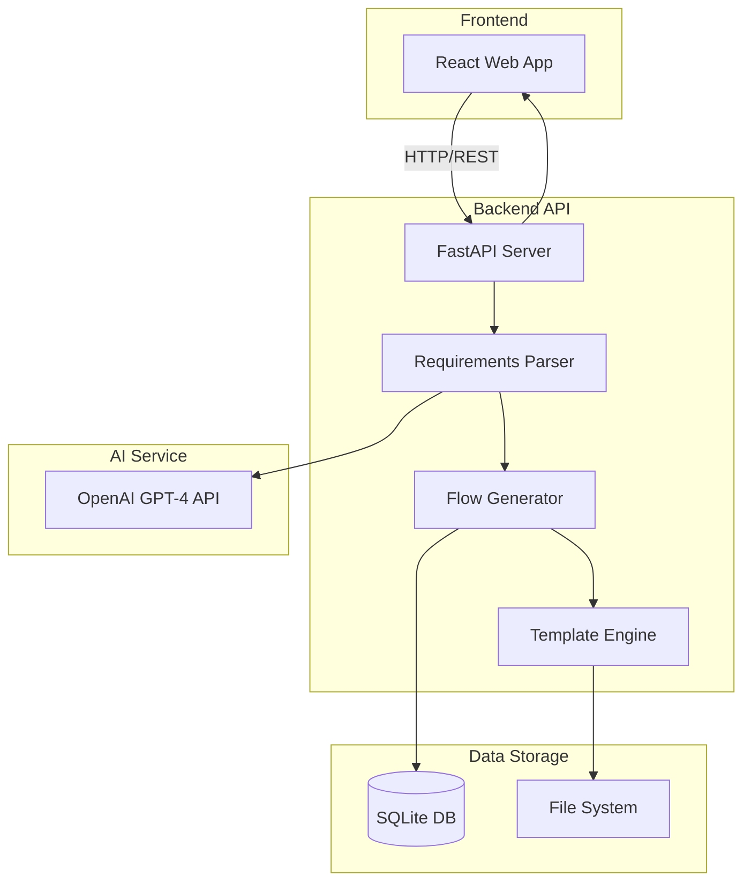
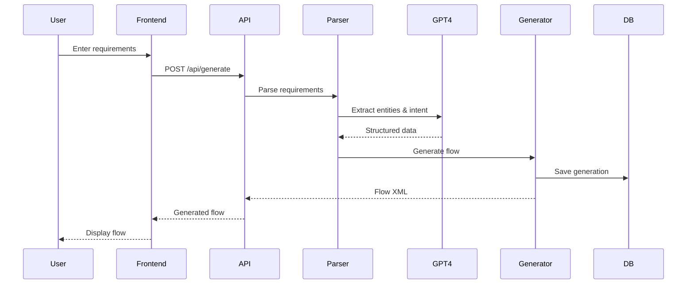

# ACE FlowSmith AI - MVP Implementation Plan

**Version:** 1.0  
**Date:** June 10, 2026  
**Timeline:** 4 Months  
**Team Size:** 5-7 developers

---

## Table of Contents

1. [MVP Overview](#1-mvp-overview)
2. [MVP Scope](#2-mvp-scope)
3. [MVP Architecture](#3-mvp-architecture)
4. [Project Structure](#4-project-structure)
5. [User Stories](#5-user-stories)
6. [Technical Implementation](#6-technical-implementation)
7. [Development Phases](#7-development-phases)
8. [Success Criteria](#8-success-criteria)
9. [Testing Strategy](#9-testing-strategy)
10. [Deployment Guide](#10-deployment-guide)

---

## 1. MVP Overview

### 1.1 MVP Goal
Create a functional prototype of ACE FlowSmith AI that demonstrates core value proposition: **AI-powered generation of ACE message flows from natural language requirements**.

### 1.2 MVP Philosophy
- **Focus on Core Value**: Flow generation from requirements
- **Simplify Everything**: Minimal features, maximum impact
- **Validate Assumptions**: Test with real developers
- **Iterate Quickly**: 2-week sprints, continuous feedback

### 1.3 What's In MVP

✅ **Included**:
- Natural language requirement input
- Simple flow generation (5-10 nodes)
- Basic subflow library (10 common subflows)
- Flow validation
- Export to ACE XML format
- Web-based UI
- Basic authentication

❌ **Excluded** (Future Phases):
- ACE Toolkit/Designer integration
- Complex flow generation (20+ nodes)
- Organization-specific training
- BAR file generation
- Advanced AI models
- Multi-tenancy
- CI/CD integration

### 1.4 MVP Success Metrics

| Metric | Target |
|--------|--------|
| Flow Generation Success Rate | > 70% |
| Generation Time | < 60 seconds |
| Developer Satisfaction | > 3.5/5 |
| Time Savings vs Manual | > 50% |
| Pilot Users | 10 developers |

---

## 2. MVP Scope

### 2.1 Core Features

#### Feature 1: Requirements Input
**Description**: Simple form to input integration requirements

**Capabilities**:
- Text area for requirement description
- Dropdowns for source/target systems
- Protocol selection (REST, SOAP, MQ)
- Data format selection (JSON, XML)

**Example Input**:
```
Title: Customer Order Integration
Description: Receive customer orders via REST API, validate customer data, 
check inventory availability, and send order to SAP system
Source System: E-commerce Portal
Target System: SAP ERP
Protocol: REST
Data Format: JSON
```

#### Feature 2: Flow Generation
**Description**: Generate ACE message flow from requirements

**Capabilities**:
- Parse requirement text
- Identify required nodes (Input, Compute, Subflow, Output)
- Generate flow structure
- Apply basic naming conventions
- Create ACE XML

**Generated Flow Components**:
- HTTPInput node
- Logging subflow call
- Validation subflow call
- Business logic compute node
- Error handling
- HTTPReply node

#### Feature 3: Subflow Library
**Description**: Pre-built library of common subflows

**Included Subflows** (10 total):
1. `StandardLogging.subflow` - Request/response logging
2. `ErrorHandling.subflow` - Standard error handling
3. `DataValidation.subflow` - JSON/XML validation
4. `CustomerValidation.subflow` - Customer data validation
5. `JSONToXML.subflow` - JSON to XML transformation
6. `XMLToJSON.subflow` - XML to JSON transformation
7. `DatabaseRead.subflow` - Database SELECT operations
8. `DatabaseWrite.subflow` - Database INSERT/UPDATE
9. `RESTAPICall.subflow` - Generic REST API invocation
10. `AuditTrail.subflow` - Audit logging

#### Feature 4: Flow Visualization
**Description**: Visual preview of generated flow

**Capabilities**:
- Node diagram display
- Connection visualization
- Node properties view
- Validation results display

#### Feature 5: Export & Download
**Description**: Export generated flow as ACE XML

**Capabilities**:
- Download .msgflow file
- Download referenced .subflow files
- Download as ZIP package
- Copy XML to clipboard

### 2.2 Technical Scope

#### Backend
- **Language**: Python 3.11
- **Framework**: FastAPI
- **AI/ML**: OpenAI GPT-4 API (for MVP speed)
- **Database**: SQLite (simple, file-based)
- **Storage**: Local file system

#### Frontend
- **Framework**: React 18 + TypeScript
- **UI Library**: Material-UI (MUI)
- **State Management**: React Context API
- **HTTP Client**: Axios

#### Infrastructure
- **Deployment**: Docker containers
- **Hosting**: Single server (AWS EC2 or similar)
- **Authentication**: Simple JWT tokens
- **No Kubernetes** (too complex for MVP)

---

## 3. MVP Architecture

### 3.1 Simplified Architecture



### 3.2 Component Breakdown

#### Frontend Components
```
src/
├── components/
│   ├── RequirementForm.tsx      # Input form
│   ├── FlowViewer.tsx           # Flow visualization
│   ├── ValidationPanel.tsx      # Validation results
│   └── ExportDialog.tsx         # Export options
├── services/
│   └── api.ts                   # API client
├── types/
│   └── models.ts                # TypeScript interfaces
└── App.tsx                      # Main app
```

#### Backend Components
```
app/
├── api/
│   ├── routes.py                # API endpoints
│   └── models.py                # Pydantic models
├── services/
│   ├── parser.py                # Requirement parser
│   ├── generator.py             # Flow generator
│   └── validator.py             # Flow validator
├── templates/
│   ├── base_flow.xml            # Flow template
│   └── subflows/                # Subflow templates
├── database/
│   └── db.py                    # Database operations
└── main.py                      # FastAPI app
```

### 3.3 Data Flow



---

## 4. Project Structure

### 4.1 Repository Structure

```
ace-flowsmith-mvp/
├── README.md
├── docker-compose.yml
├── .env.example
├── .gitignore
│
├── backend/
│   ├── Dockerfile
│   ├── requirements.txt
│   ├── pytest.ini
│   ├── app/
│   │   ├── __init__.py
│   │   ├── main.py
│   │   ├── config.py
│   │   ├── api/
│   │   │   ├── __init__.py
│   │   │   ├── routes.py
│   │   │   ├── models.py
│   │   │   └── dependencies.py
│   │   ├── services/
│   │   │   ├── __init__.py
│   │   │   ├── parser.py
│   │   │   ├── generator.py
│   │   │   ├── validator.py
│   │   │   └── ai_service.py
│   │   ├── templates/
│   │   │   ├── base_flow.xml
│   │   │   └── subflows/
│   │   │       ├── StandardLogging.subflow
│   │   │       ├── ErrorHandling.subflow
│   │   │       └── ... (8 more)
│   │   ├── database/
│   │   │   ├── __init__.py
│   │   │   ├── db.py
│   │   │   └── models.py
│   │   └── utils/
│   │       ├── __init__.py
│   │       └── xml_builder.py
│   └── tests/
│       ├── test_parser.py
│       ├── test_generator.py
│       └── test_api.py
│
├── frontend/
│   ├── Dockerfile
│   ├── package.json
│   ├── tsconfig.json
│   ├── vite.config.ts
│   ├── public/
│   ├── src/
│   │   ├── App.tsx
│   │   ├── main.tsx
│   │   ├── components/
│   │   │   ├── RequirementForm.tsx
│   │   │   ├── FlowViewer.tsx
│   │   │   ├── ValidationPanel.tsx
│   │   │   ├── ExportDialog.tsx
│   │   │   └── Layout.tsx
│   │   ├── services/
│   │   │   └── api.ts
│   │   ├── types/
│   │   │   └── models.ts
│   │   ├── hooks/
│   │   │   └── useFlowGeneration.ts
│   │   └── utils/
│   │       └── flowRenderer.ts
│   └── tests/
│       └── App.test.tsx
│
├── docs/
│   ├── API.md
│   ├── USER_GUIDE.md
│   └── DEVELOPMENT.md
│
└── scripts/
    ├── setup.sh
    ├── seed_data.py
    └── deploy.sh
```

### 4.2 Key Files Description

#### Backend Files

**`backend/app/main.py`** - FastAPI application entry point
```python
from fastapi import FastAPI
from fastapi.middleware.cors import CORSMiddleware
from app.api import routes
from app.database import db

app = FastAPI(title="ACE FlowSmith MVP")

# CORS middleware
app.add_middleware(
    CORSMiddleware,
    allow_origins=["*"],
    allow_methods=["*"],
    allow_headers=["*"],
)

# Include routes
app.include_router(routes.router, prefix="/api")

@app.on_event("startup")
async def startup():
    db.init_db()

@app.get("/health")
async def health_check():
    return {"status": "healthy"}
```

**`backend/app/api/routes.py`** - API endpoints
```python
from fastapi import APIRouter, HTTPException
from app.api.models import RequirementInput, GeneratedFlow
from app.services.parser import RequirementParser
from app.services.generator import FlowGenerator

router = APIRouter()

@router.post("/generate", response_model=GeneratedFlow)
async def generate_flow(requirement: RequirementInput):
    """Generate ACE flow from requirements"""
    try:
        # Parse requirements
        parser = RequirementParser()
        parsed = await parser.parse(requirement)
        
        # Generate flow
        generator = FlowGenerator()
        flow = await generator.generate(parsed)
        
        return flow
    except Exception as e:
        raise HTTPException(status_code=500, detail=str(e))

@router.get("/subflows")
async def list_subflows():
    """List available subflows"""
    # Return list of available subflows
    pass

@router.post("/validate")
async def validate_flow(flow_xml: str):
    """Validate generated flow"""
    # Validate flow XML
    pass
```

**`backend/app/services/generator.py`** - Flow generation logic
```python
from typing import Dict, List
from app.utils.xml_builder import XMLBuilder
from app.database.db import save_generation

class FlowGenerator:
    def __init__(self):
        self.xml_builder = XMLBuilder()
    
    async def generate(self, parsed_requirement: Dict) -> Dict:
        """Generate ACE flow from parsed requirement"""
        
        # Create flow structure
        flow = {
            "name": f"{parsed_requirement['title']}Flow",
            "nodes": [],
            "connections": []
        }
        
        # Add input node
        flow["nodes"].append(self._create_input_node(parsed_requirement))
        
        # Add logging subflow
        flow["nodes"].append(self._create_subflow_node("StandardLogging"))
        
        # Add validation subflow
        flow["nodes"].append(self._create_subflow_node("DataValidation"))
        
        # Add business logic nodes based on requirement
        business_nodes = self._create_business_logic(parsed_requirement)
        flow["nodes"].extend(business_nodes)
        
        # Add error handling
        flow["nodes"].append(self._create_subflow_node("ErrorHandling"))
        
        # Add output node
        flow["nodes"].append(self._create_output_node(parsed_requirement))
        
        # Create connections
        flow["connections"] = self._create_connections(flow["nodes"])
        
        # Build XML
        xml_content = self.xml_builder.build_flow(flow)
        
        # Save to database
        generation_id = save_generation(parsed_requirement, flow, xml_content)
        
        return {
            "generation_id": generation_id,
            "flow_name": flow["name"],
            "xml_content": xml_content,
            "nodes": flow["nodes"],
            "validation": self._validate_flow(xml_content)
        }
    
    def _create_input_node(self, requirement: Dict) -> Dict:
        """Create input node based on protocol"""
        protocol = requirement.get("protocol", "REST")
        
        if protocol == "REST":
            return {
                "id": "node_1",
                "type": "HTTPInput",
                "name": "ReceiveRequest",
                "properties": {
                    "URLSpecifier": f"/api/{requirement['title'].lower()}",
                    "messageDomainProperty": requirement.get("data_format", "JSON")
                }
            }
        # Add other protocols...
    
    def _create_business_logic(self, requirement: Dict) -> List[Dict]:
        """Create business logic nodes based on requirement"""
        nodes = []
        
        # Analyze requirement description for operations
        description = requirement.get("description", "").lower()
        
        if "validate" in description:
            nodes.append(self._create_subflow_node("CustomerValidation"))
        
        if "transform" in description or "convert" in description:
            if "json" in description and "xml" in description:
                nodes.append(self._create_subflow_node("JSONToXML"))
        
        if "database" in description or "db" in description:
            nodes.append(self._create_subflow_node("DatabaseRead"))
        
        if "api" in description or "rest" in description:
            nodes.append(self._create_subflow_node("RESTAPICall"))
        
        return nodes
```

#### Frontend Files

**`frontend/src/components/RequirementForm.tsx`**
```typescript
import React, { useState } from 'react';
import { TextField, Button, MenuItem, Box, Paper } from '@mui/material';
import { RequirementInput } from '../types/models';
import { generateFlow } from '../services/api';

export const RequirementForm: React.FC = () => {
  const [requirement, setRequirement] = useState<RequirementInput>({
    title: '',
    description: '',
    sourceSystem: '',
    targetSystem: '',
    protocol: 'REST',
    dataFormat: 'JSON'
  });
  
  const [loading, setLoading] = useState(false);
  
  const handleSubmit = async (e: React.FormEvent) => {
    e.preventDefault();
    setLoading(true);
    
    try {
      const result = await generateFlow(requirement);
      // Handle success - show generated flow
      console.log('Generated flow:', result);
    } catch (error) {
      console.error('Generation failed:', error);
    } finally {
      setLoading(false);
    }
  };
  
  return (
    <Paper elevation={3} sx={{ p: 3 }}>
      <form onSubmit={handleSubmit}>
        <Box sx={{ display: 'flex', flexDirection: 'column', gap: 2 }}>
          <TextField
            label="Integration Title"
            value={requirement.title}
            onChange={(e) => setRequirement({...requirement, title: e.target.value})}
            required
            fullWidth
          />
          
          <TextField
            label="Description"
            value={requirement.description}
            onChange={(e) => setRequirement({...requirement, description: e.target.value})}
            multiline
            rows={4}
            required
            fullWidth
            placeholder="Describe what this integration should do..."
          />
          
          <TextField
            label="Source System"
            value={requirement.sourceSystem}
            onChange={(e) => setRequirement({...requirement, sourceSystem: e.target.value})}
            required
            fullWidth
          />
          
          <TextField
            label="Target System"
            value={requirement.targetSystem}
            onChange={(e) => setRequirement({...requirement, targetSystem: e.target.value})}
            required
            fullWidth
          />
          
          <TextField
            select
            label="Protocol"
            value={requirement.protocol}
            onChange={(e) => setRequirement({...requirement, protocol: e.target.value})}
            fullWidth
          >
            <MenuItem value="REST">REST</MenuItem>
            <MenuItem value="SOAP">SOAP</MenuItem>
            <MenuItem value="MQ">IBM MQ</MenuItem>
          </TextField>
          
          <TextField
            select
            label="Data Format"
            value={requirement.dataFormat}
            onChange={(e) => setRequirement({...requirement, dataFormat: e.target.value})}
            fullWidth
          >
            <MenuItem value="JSON">JSON</MenuItem>
            <MenuItem value="XML">XML</MenuItem>
            <MenuItem value="CSV">CSV</MenuItem>
          </TextField>
          
          <Button
            type="submit"
            variant="contained"
            size="large"
            disabled={loading}
          >
            {loading ? 'Generating...' : 'Generate Flow'}
          </Button>
        </Box>
      </form>
    </Paper>
  );
};
```

---

## 5. User Stories

### 5.1 Epic: Flow Generation

#### Story 1: Basic Flow Generation
**As a** developer  
**I want to** input integration requirements in natural language  
**So that** I can quickly generate an ACE message flow

**Acceptance Criteria**:
- [ ] User can enter requirement title and description
- [ ] User can select source and target systems
- [ ] User can choose protocol (REST/SOAP/MQ)
- [ ] User can select data format (JSON/XML)
- [ ] System generates flow within 60 seconds
- [ ] Generated flow includes input, logging, validation, and output nodes

**Priority**: P0 (Must Have)

#### Story 2: Flow Visualization
**As a** developer  
**I want to** see a visual representation of the generated flow  
**So that** I can understand the flow structure before exporting

**Acceptance Criteria**:
- [ ] Flow displayed as node diagram
- [ ] Nodes show type and name
- [ ] Connections between nodes are visible
- [ ] User can click nodes to see properties
- [ ] Diagram is responsive and zoomable

**Priority**: P0 (Must Have)

#### Story 3: Flow Export
**As a** developer  
**I want to** download the generated flow as ACE XML  
**So that** I can import it into ACE Toolkit

**Acceptance Criteria**:
- [ ] User can download .msgflow file
- [ ] User can download referenced subflows
- [ ] User can download complete package as ZIP
- [ ] Downloaded files are valid ACE XML
- [ ] Files can be imported into ACE Toolkit

**Priority**: P0 (Must Have)

### 5.2 Epic: Subflow Library

#### Story 4: View Subflow Library
**As a** developer  
**I want to** browse available subflows  
**So that** I know what reusable components are available

**Acceptance Criteria**:
- [ ] User can view list of all subflows
- [ ] Each subflow shows name, description, and category
- [ ] User can search/filter subflows
- [ ] User can view subflow details (inputs/outputs)

**Priority**: P1 (Should Have)

### 5.3 Epic: Validation

#### Story 5: Flow Validation
**As a** developer  
**I want to** validate the generated flow  
**So that** I can ensure it meets ACE standards

**Acceptance Criteria**:
- [ ] System validates XML syntax
- [ ] System checks for required nodes
- [ ] System validates node connections
- [ ] Validation results displayed clearly
- [ ] Warnings and errors are actionable

**Priority**: P0 (Must Have)

---

## 6. Technical Implementation

### 6.1 Backend Implementation

#### Step 1: Setup FastAPI Project
```bash
# Create virtual environment
python -m venv venv
source venv/bin/activate  # On Windows: venv\Scripts\activate

# Install dependencies
pip install fastapi uvicorn pydantic sqlalchemy openai python-dotenv

# Create requirements.txt
pip freeze > requirements.txt
```

#### Step 2: Implement Requirements Parser
```python
# app/services/parser.py
import openai
from typing import Dict
from app.config import settings

class RequirementParser:
    def __init__(self):
        openai.api_key = settings.OPENAI_API_KEY
    
    async def parse(self, requirement: Dict) -> Dict:
        """Parse requirement using GPT-4"""
        
        prompt = f"""
        Analyze this integration requirement and extract structured information:
        
        Title: {requirement['title']}
        Description: {requirement['description']}
        Source: {requirement['sourceSystem']}
        Target: {requirement['targetSystem']}
        Protocol: {requirement['protocol']}
        Format: {requirement['dataFormat']}
        
        Extract:
        1. Required operations (validate, transform, enrich, etc.)
        2. Data entities involved
        3. Integration pattern (request-response, fire-and-forget, etc.)
        4. Required subflows
        
        Return as JSON.
        """
        
        response = openai.ChatCompletion.create(
            model="gpt-4",
            messages=[
                {"role": "system", "content": "You are an ACE integration expert."},
                {"role": "user", "content": prompt}
            ],
            temperature=0.3
        )
        
        # Parse GPT-4 response
        parsed = self._parse_gpt_response(response)
        
        return {
            **requirement,
            "parsed": parsed
        }
```

#### Step 3: Implement XML Builder
```python
# app/utils/xml_builder.py
from xml.etree.ElementTree import Element, SubElement, tostring
from xml.dom import minidom

class XMLBuilder:
    def build_flow(self, flow: Dict) -> str:
        """Build ACE flow XML"""
        
        # Create root element
        root = Element('ecore:EPackage')
        root.set('xmi:version', '2.0')
        root.set('xmlns:xmi', 'http://www.omg.org/XMI')
        root.set('xmlns:ecore', 'http://www.eclipse.org/emf/2002/Ecore')
        root.set('xmlns:eflow', 'http://www.ibm.com/wbi/2005/eflow')
        
        # Create flow composite
        composite = SubElement(root, 'eClassifiers')
        composite.set('xmi:type', 'eflow:FCMComposite')
        composite.set('name', flow['name'])
        
        # Add composition
        composition = SubElement(composite, 'composition')
        
        # Add nodes
        for node in flow['nodes']:
            self._add_node(composition, node)
        
        # Add connections
        for conn in flow['connections']:
            self._add_connection(composition, conn)
        
        # Pretty print XML
        xml_str = minidom.parseString(tostring(root)).toprettyxml(indent="  ")
        
        return xml_str
    
    def _add_node(self, parent: Element, node: Dict):
        """Add node to composition"""
        node_elem = SubElement(parent, 'nodes')
        node_elem.set('xmi:type', f'ComIbm{node["type"]}.msgnode:FCMComposite_1')
        node_elem.set('xmi:id', node['id'])
        node_elem.set('location', f"{node.get('x', 100)},{node.get('y', 100)}")
        
        # Add node properties
        for key, value in node.get('properties', {}).items():
            node_elem.set(key, str(value))
```

### 6.2 Frontend Implementation

#### Step 1: Setup React Project
```bash
# Create Vite project
npm create vite@latest frontend -- --template react-ts

# Install dependencies
cd frontend
npm install @mui/material @emotion/react @emotion/styled axios react-flow-renderer
```

#### Step 2: Implement API Service
```typescript
// src/services/api.ts
import axios from 'axios';
import { RequirementInput, GeneratedFlow } from '../types/models';

const API_BASE_URL = import.meta.env.VITE_API_URL || 'http://localhost:8000/api';

const api = axios.create({
  baseURL: API_BASE_URL,
  headers: {
    'Content-Type': 'application/json',
  },
});

export const generateFlow = async (requirement: RequirementInput): Promise<GeneratedFlow> => {
  const response = await api.post<GeneratedFlow>('/generate', requirement);
  return response.data;
};

export const listSubflows = async () => {
  const response = await api.get('/subflows');
  return response.data;
};

export const validateFlow = async (flowXml: string) => {
  const response = await api.post('/validate', { flow_xml: flowXml });
  return response.data;
};
```

#### Step 3: Implement Flow Viewer
```typescript
// src/components/FlowViewer.tsx
import React from 'react';
import ReactFlow, { Node, Edge } from 'react-flow-renderer';
import { GeneratedFlow } from '../types/models';

interface FlowViewerProps {
  flow: GeneratedFlow;
}

export const FlowViewer: React.FC<FlowViewerProps> = ({ flow }) => {
  // Convert flow nodes to ReactFlow format
  const nodes: Node[] = flow.nodes.map((node, index) => ({
    id: node.id,
    type: 'default',
    data: { label: node.name },
    position: { x: 100 + (index * 200), y: 100 },
  }));
  
  // Convert connections to ReactFlow edges
  const edges: Edge[] = flow.connections.map((conn, index) => ({
    id: `edge-${index}`,
    source: conn.sourceNode,
    target: conn.targetNode,
    animated: true,
  }));
  
  return (
    <div style={{ height: '500px', border: '1px solid #ddd' }}>
      <ReactFlow
        nodes={nodes}
        edges={edges}
        fitView
      />
    </div>
  );
};
```

### 6.3 Database Schema (SQLite)

```sql
-- generations table
CREATE TABLE generations (
    id INTEGER PRIMARY KEY AUTOINCREMENT,
    requirement_title TEXT NOT NULL,
    requirement_description TEXT,
    source_system TEXT,
    target_system TEXT,
    protocol TEXT,
    data_format TEXT,
    flow_name TEXT NOT NULL,
    xml_content TEXT NOT NULL,
    created_at TIMESTAMP DEFAULT CURRENT_TIMESTAMP
);

-- subflows table
CREATE TABLE subflows (
    id INTEGER PRIMARY KEY AUTOINCREMENT,
    name TEXT NOT NULL UNIQUE,
    category TEXT,
    description TEXT,
    xml_content TEXT NOT NULL,
    usage_count INTEGER DEFAULT 0,
    created_at TIMESTAMP DEFAULT CURRENT_TIMESTAMP
);

-- feedback table
CREATE TABLE feedback (
    id INTEGER PRIMARY KEY AUTOINCREMENT,
    generation_id INTEGER,
    rating INTEGER CHECK(rating >= 1 AND rating <= 5),
    comments TEXT,
    created_at TIMESTAMP DEFAULT CURRENT_TIMESTAMP,
    FOREIGN KEY (generation_id) REFERENCES generations(id)
);
```

---

## 7. Development Phases

### Phase 1: Foundation (Weeks 1-2)

**Goals**: Setup project structure and basic infrastructure

**Tasks**:
- [ ] Setup Git repository
- [ ] Create project structure
- [ ] Setup Docker environment
- [ ] Configure FastAPI backend
- [ ] Configure React frontend
- [ ] Setup SQLite database
- [ ] Create basic API endpoints
- [ ] Implement authentication (simple JWT)

**Deliverables**:
- Working dev environment
- Basic API responding to health checks
- Frontend displaying hello world

### Phase 2: Core Generation (Weeks 3-6)

**Goals**: Implement core flow generation capability

**Tasks**:
- [ ] Implement requirement parser with GPT-4
- [ ] Create flow generator logic
- [ ] Build XML builder utility
- [ ] Create 10 subflow templates
- [ ] Implement flow validation
- [ ] Build requirement input form
- [ ] Create flow visualization component
- [ ] Integrate frontend with backend

**Deliverables**:
- Working flow generation from requirements
- Visual flow display
- Valid ACE XML output

### Phase 3: Polish & Testing (Weeks 7-10)

**Goals**: Refine UX and ensure quality

**Tasks**:
- [ ] Improve UI/UX design
- [ ] Add error handling
- [ ] Implement export functionality
- [ ] Write unit tests (backend)
- [ ] Write component tests (frontend)
- [ ] Perform integration testing
- [ ] Fix bugs and issues
- [ ] Optimize performance

**Deliverables**:
- Polished user interface
- Comprehensive test coverage
- Bug-free experience

### Phase 4: Pilot & Feedback (Weeks 11-16)

**Goals**: Deploy to pilot users and gather feedback

**Tasks**:
- [ ] Deploy to staging environment
- [ ] Create user documentation
- [ ] Onboard 10 pilot users
- [ ] Collect feedback
- [ ] Analyze usage metrics
- [ ] Implement high-priority improvements
- [ ] Prepare for production

**Deliverables**:
- Deployed MVP
- User documentation
- Feedback report
- Improvement roadmap

---

## 8. Success Criteria

### 8.1 Technical Success Criteria

✅ **Functional Requirements**:
- [ ] System generates valid ACE XML flows
- [ ] Generated flows can be imported into ACE Toolkit
- [ ] Flow generation completes in < 60 seconds
- [ ] System handles 10 concurrent users
- [ ] 95% uptime during pilot period

✅ **Quality Requirements**:
- [ ] 80%+ code coverage
- [ ] Zero critical bugs
- [ ] < 5 minor bugs
- [ ] All user stories completed
- [ ] Documentation complete

### 8.2 Business Success Criteria

✅ **User Adoption**:
- [ ] 10 pilot users onboarded
- [ ] 70%+ weekly active users
- [ ] 50+ flows generated
- [ ] 3.5/5 average satisfaction rating

✅ **Value Delivery**:
- [ ] 50%+ time savings vs manual development
- [ ] 70%+ generation success rate
- [ ] 80%+ of generated flows used without modification
- [ ] Positive ROI projection for full product

### 8.3 Learning Objectives

✅ **Validation**:
- [ ] Confirm developers find value in AI-generated flows
- [ ] Identify most common use cases
- [ ] Understand quality expectations
- [ ] Determine optimal UX patterns
- [ ] Validate technical approach

---

## 9. Testing Strategy

### 9.1 Unit Testing

**Backend Tests** (pytest):
```python
# tests/test_generator.py
import pytest
from app.services.generator import FlowGenerator

def test_create_input_node():
    generator = FlowGenerator()
    requirement = {
        "title": "Test Flow",
        "protocol": "REST",
        "data_format": "JSON"
    }
    
    node = generator._create_input_node(requirement)
    
    assert node["type"] == "HTTPInput"
    assert node["properties"]["messageDomainProperty"] == "JSON"

def test_generate_flow():
    generator = FlowGenerator()
    parsed_requirement = {
        "title": "Customer Order",
        "description": "Validate and process orders",
        "protocol": "REST",
        "data_format": "JSON"
    }
    
    flow = await generator.generate(parsed_requirement)
    
    assert flow["flow_name"] == "CustomerOrderFlow"
    assert len(flow["nodes"]) >= 5  # Input, logging, validation, logic, output
    assert flow["xml_content"] is not None
```

**Frontend Tests** (Jest + React Testing Library):
```typescript
// tests/RequirementForm.test.tsx
import { render, screen, fireEvent } from '@testing-library/react';
import { RequirementForm } from '../components/RequirementForm';

test('renders requirement form', () => {
  render(<RequirementForm />);
  expect(screen.getByLabelText('Integration Title')).toBeInTheDocument();
  expect(screen.getByLabelText('Description')).toBeInTheDocument();
});

test('submits form with valid data', async () => {
  render(<RequirementForm />);
  
  fireEvent.change(screen.getByLabelText('Integration Title'), {
    target: { value: 'Test Integration' }
  });
  
  fireEvent.change(screen.getByLabelText('Description'), {
    target: { value: 'Test description' }
  });
  
  fireEvent.click(screen.getByText('Generate Flow'));
  
  // Assert API call was made
  // Assert loading state is shown
});
```

### 9.2 Integration Testing

**API Integration Tests**:
```python
# tests/test_api.py
from fastapi.testclient import TestClient
from app.main import app

client = TestClient(app)

def test_generate_flow_endpoint():
    requirement = {
        "title": "Customer Order Integration",
        "description": "Process customer orders",
        "sourceSystem": "E-commerce",
        "targetSystem": "SAP",
        "protocol": "REST",
        "dataFormat": "JSON"
    }
    
    response = client.post("/api/generate", json=requirement)
    
    assert response.status_code == 200
    data = response.json()
    assert "generation_id" in data
    assert "xml_content" in data
    assert data["flow_name"].endswith("Flow")
```

### 9.3 End-to-End Testing

**User Journey Tests** (Playwright/Cypress):
```typescript
// e2e/flow-generation.spec.ts
test('complete flow generation journey', async ({ page }) => {
  // Navigate to app
  await page.goto('http://localhost:3000');
  
  // Fill requirement form
  await page.fill('[name="title"]', 'Customer Order Integration');
  await page.fill('[name="description"]', 'Process customer orders via REST API');
  await page.selectOption('[name="protocol"]', 'REST');
  
  // Submit form
  await page.click('button:has-text("Generate Flow")');
  
  // Wait for generation
  await page.waitForSelector('.flow-viewer');
  
  // Verify flow is displayed
  expect(await page.textContent('.flow-name')).toContain('CustomerOrderIntegrationFlow');
  
  // Download flow
  await page.click('button:has-text("Download")');
  
  // Verify download
  const download = await page.waitForEvent('download');
  expect(download.suggestedFilename()).toMatch(/\.msgflow$/);
});
```

### 9.4 Performance Testing

**Load Testing** (Locust):
```python
# locustfile.py
from locust import HttpUser, task, between

class FlowSmithUser(HttpUser):
    wait_time = between(1, 3)
    
    @task
    def generate_flow(self):
        self.client.post("/api/generate", json={
            "title": "Test Flow",
            "description": "Test description",
            "sourceSystem": "System A",
            "targetSystem": "System B",
            "protocol": "REST",
            "dataFormat": "JSON"
        })
```

---

## 10. Deployment Guide

### 10.1 Local Development Setup

```bash
# Clone repository
git clone https://github.com/your-org/ace-flowsmith-mvp.git
cd ace-flowsmith-mvp

# Copy environment file
cp .env.example .env

# Edit .env with your settings
# OPENAI_API_KEY=your_key_here
# DATABASE_URL=sqlite:///./flowsmith.db

# Start with Docker Compose
docker-compose up -d

# Access application
# Frontend: http://localhost:3000
# Backend API: http://localhost:8000
# API Docs: http://localhost:8000/docs
```

### 10.2 Docker Compose Configuration

```yaml
# docker-compose.yml
version: '3.8'

services:
  backend:
    build: ./backend
    ports:
      - "8000:8000"
    environment:
      - OPENAI_API_KEY=${OPENAI_API_KEY}
      - DATABASE_URL=sqlite:///./data/flowsmith.db
    volumes:
      - ./backend:/app
      - ./data:/app/data
    command: uvicorn app.main:app --host 0.0.0.0 --port 8000 --reload
  
  frontend:
    build: ./frontend
    ports:
      - "3000:3000"
    environment:
      - VITE_API_URL=http://localhost:8000/api
    volumes:
      - ./frontend:/app
      - /app/node_modules
    command: npm run dev -- --host
  
volumes:
  data:
```

### 10.3 Production Deployment (AWS EC2)

```bash
# SSH into EC2 instance
ssh -i your-key.pem ubuntu@your-ec2-ip

# Install Docker
sudo apt-get update
sudo apt-get install -y docker.io docker-compose

# Clone repository
git clone https://github.com/your-org/ace-flowsmith-mvp.git
cd ace-flowsmith-mvp

# Setup environment
cp .env.example .env
nano .env  # Edit with production values

# Build and start
docker-compose -f docker-compose.prod.yml up -d

# Setup nginx reverse proxy
sudo apt-get install -y nginx
sudo nano /etc/nginx/sites-available/flowsmith

# Nginx configuration
server {
    listen 80;
    server_name your-domain.com;
    
    location / {
        proxy_pass http://localhost:3000;
        proxy_http_version 1.1;
        proxy_set_header Upgrade $http_upgrade;
        proxy_set_header Connection 'upgrade';
        proxy_set_header Host $host;
        proxy_cache_bypass $http_upgrade;
    }
    
    location /api {
        proxy_pass http://localhost:8000;
        proxy_set_header Host $host;
        proxy_set_header X-Real-IP $remote_addr;
    }
}

# Enable site
sudo ln -s /etc/nginx/sites-available/flowsmith /etc/nginx/sites-enabled/
sudo nginx -t
sudo systemctl restart nginx

# Setup SSL with Let's Encrypt
sudo apt-get install -y certbot python3-certbot-nginx
sudo certbot --nginx -d your-domain.com
```

### 10.4 Monitoring Setup

```bash
# Install monitoring tools
docker-compose -f docker-compose.monitoring.yml up -d

# Prometheus configuration
# prometheus.yml
global:
  scrape_interval: 15s

scrape_configs:
  - job_name: 'flowsmith-backend'
    static_configs:
      - targets: ['backend:8000']

# Grafana dashboards
# Access at http://localhost:3001
# Default credentials: admin/admin
```

---

## 11. Risk Mitigation

### 11.1 Technical Risks

| Risk | Mitigation |
|------|------------|
| OpenAI API rate limits | Implement caching, queue requests |
| GPT-4 costs too high | Use GPT-3.5-turbo for MVP, optimize prompts |
| Generated XML invalid | Extensive validation, template-based generation |
| Performance issues | Load testing, optimization, caching |

### 11.2 Timeline Risks

| Risk | Mitigation |
|------|------------|
| Scope creep | Strict MVP scope, defer features to Phase 2 |
| Technical blockers | Weekly risk reviews, early prototyping |
| Resource constraints | Prioritize P0 features, cut P2 features |
| Integration complexity | Start with simple flows, iterate |

---

## 12. Next Steps After MVP

### 12.1 Phase 2 Features
- ACE Toolkit plugin
- Organization-specific training
- Advanced pattern recognition
- BAR file generation
- Batch processing

### 12.2 Phase 3 Features
- ACE Designer integration
- Multi-tenancy
- Advanced AI models
- CI/CD integration
- Enterprise features

---

## Appendix A: Environment Variables

```bash
# .env.example

# OpenAI Configuration
OPENAI_API_KEY=sk-your-key-here
OPENAI_MODEL=gpt-4

# Database
DATABASE_URL=sqlite:///./flowsmith.db

# API Configuration
API_HOST=0.0.0.0
API_PORT=8000
API_RELOAD=true

# Frontend
VITE_API_URL=http://localhost:8000/api

# Security
JWT_SECRET=your-secret-key-here
JWT_ALGORITHM=HS256
JWT_EXPIRATION=3600

# Logging
LOG_LEVEL=INFO
```

## Appendix B: Useful Commands

```bash
# Backend
cd backend
python -m pytest                    # Run tests
python -m pytest --cov              # Run tests with coverage
uvicorn app.main:app --reload       # Start dev server
python scripts/seed_data.py         # Seed database

# Frontend
cd frontend
npm test                            # Run tests
npm run build                       # Build for production
npm run preview                     # Preview production build

# Docker
docker-compose up -d                # Start all services
docker-compose logs -f backend      # View backend logs
docker-compose down                 # Stop all services
docker-compose build                # Rebuild images
```

---

**End of MVP Implementation Plan**