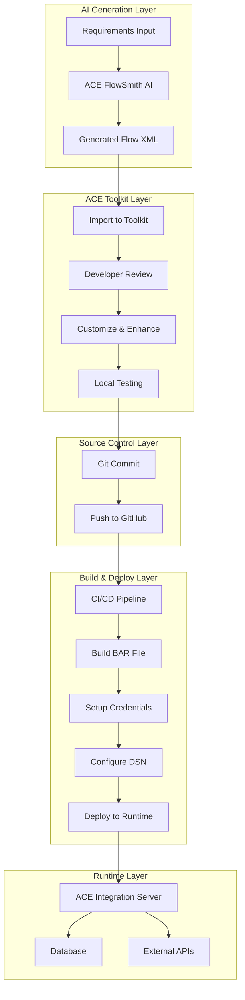
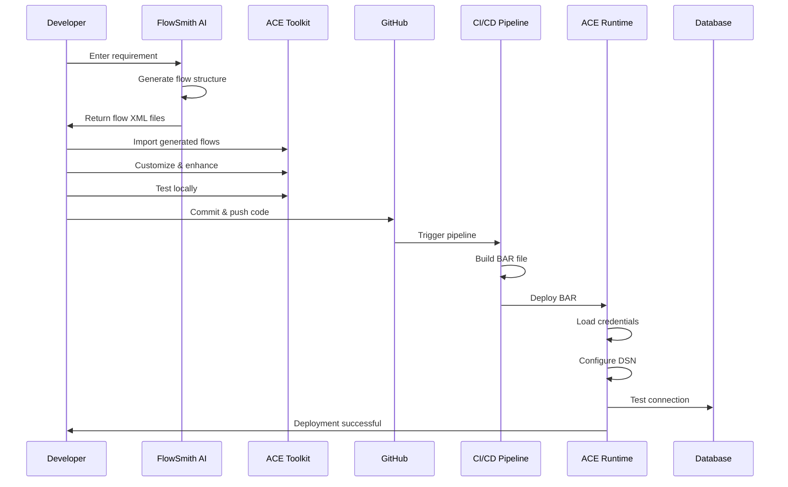

# ACE FlowSmith AI - Integrated Solution
## AI-Powered Flow Generation + Traditional ACE Toolkit Workflow

**Version:** 1.0  
**Date:** June 10, 2026  
**Purpose:** Combine AI flow generation with ACE Toolkit development workflow

---

## Table of Contents

1. [Integrated Solution Overview](#1-integrated-solution-overview)
2. [Complete Workflow](#2-complete-workflow)
3. [Architecture Integration](#3-architecture-integration)
4. [Demo Product Specifications](#4-demo-product-specifications)
5. [Implementation Roadmap](#5-implementation-roadmap)
6. [Quick Start Demo](#6-quick-start-demo)

---

## 1. Integrated Solution Overview

### 1.1 The Complete Picture



### 1.2 Value Proposition

**Traditional Approach:**
- Developer manually creates flows in Toolkit (2-3 days)
- Manual coding of ESQL (1-2 days)
- Testing and debugging (1-2 days)
- **Total: 4-7 days per integration**

**With ACE FlowSmith AI:**
- AI generates 80% of flow structure (5 minutes)
- Developer reviews and customizes (2-4 hours)
- Testing and deployment (4-6 hours)
- **Total: 1 day per integration**

**Time Savings: 75-85%**

### 1.3 How It Works Together

1. **AI Generation**: Developer describes requirement → AI generates flow
2. **Toolkit Import**: Generated XML imported into ACE Toolkit
3. **Developer Enhancement**: Developer adds business logic, customizes
4. **Source Control**: Code committed to GitHub (no credentials)
5. **CI/CD Build**: Automated BAR file creation
6. **Runtime Deployment**: Deploy with credentials and DSN setup
7. **Production**: Running integration with monitoring

---

## 2. Complete Workflow

### 2.1 Step-by-Step Process

#### Phase 1: AI-Powered Generation (5-10 minutes)

```
Developer Action:
1. Open ACE FlowSmith AI web interface
2. Enter requirement:
   "Create REST API to receive customer orders, validate customer in database,
    check inventory, calculate pricing, and send order to SAP system"
3. Click "Generate Flow"

AI Output:
- CustomerOrderFlow.msgflow (main flow)
- CustomerValidation.subflow
- InventoryCheck.subflow
- PriceCalculation.subflow
- SAPIntegration.subflow
- All ESQL modules
- Database node configurations
```

#### Phase 2: Toolkit Import & Customization (2-4 hours)

```
Developer Action:
1. Download generated files from AI
2. Import into ACE Toolkit workspace
3. Review generated flow structure
4. Customize business logic:
   - Add company-specific validation rules
   - Enhance error handling
   - Add audit logging
   - Configure database DSN references
5. Test locally with test integration server
```

#### Phase 3: Source Control (10 minutes)

```
Developer Action:
1. Commit changes to Git:
   git add applications/CustomerOrderApp/
   git commit -m "feat: Add customer order integration"
   git push origin feature/customer-orders

2. Create pull request
3. Code review by team
4. Merge to main branch
```

#### Phase 4: Automated Build (5 minutes)

```
CI/CD Pipeline:
1. Triggered by GitHub push
2. Build BAR file with environment properties
3. Run automated tests
4. Upload BAR artifact
5. Notify team
```

#### Phase 5: Runtime Deployment (15 minutes)

```
DevOps Action:
1. Setup credentials on runtime server:
   mqsisetdbparms ACE_NODE -n jdbc::CUSTOMER_DB -u user -p pass
   
2. Configure DSN:
   Edit /etc/odbc.ini with database connection details
   
3. Deploy BAR file:
   mqsideploy ACE_NODE -e ACE_SERVER -a CustomerOrderApp.bar
   
4. Verify deployment:
   curl http://server:7800/api/orders
```

### 2.2 Workflow Diagram



---

## 3. Architecture Integration

### 3.1 System Components

```
┌─────────────────────────────────────────────────────────────┐
│                    ACE FlowSmith AI                         │
│  ┌──────────────┐  ┌──────────────┐  ┌──────────────┐     │
│  │ Web UI       │  │ AI Engine    │  │ Flow         │     │
│  │ (React)      │  │ (GPT-4)      │  │ Generator    │     │
│  └──────────────┘  └──────────────┘  └──────────────┘     │
└─────────────────────────────────────────────────────────────┘
                            ↓
                    Generated XML Files
                            ↓
┌─────────────────────────────────────────────────────────────┐
│                    ACE Toolkit (Desktop)                     │
│  ┌──────────────┐  ┌──────────────┐  ┌──────────────┐     │
│  │ Flow Editor  │  │ ESQL Editor  │  │ Test Server  │     │
│  └──────────────┘  └──────────────┘  └──────────────┘     │
└─────────────────────────────────────────────────────────────┘
                            ↓
                      Git Commit & Push
                            ↓
┌─────────────────────────────────────────────────────────────┐
│                    GitHub Repository                         │
│  ┌──────────────┐  ┌──────────────┐  ┌──────────────┐     │
│  │ Source Code  │  │ CI/CD        │  │ Artifacts    │     │
│  └──────────────┘  └──────────────┘  └──────────────┘     │
└─────────────────────────────────────────────────────────────┘
                            ↓
                    Automated Build & Deploy
                            ↓
┌─────────────────────────────────────────────────────────────┐
│                    ACE Runtime Server                        │
│  ┌──────────────┐  ┌──────────────┐  ┌──────────────┐     │
│  │ Integration  │  │ Credentials  │  │ Database     │     │
│  │ Server       │  │ (setdbparms) │  │ DSN Config   │     │
│  └──────────────┘  └──────────────┘  └──────────────┘     │
└─────────────────────────────────────────────────────────────┘
```

### 3.2 Data Flow

```
Requirements (Text)
    ↓
AI Processing (GPT-4)
    ↓
Flow XML + ESQL
    ↓
Toolkit Import
    ↓
Developer Customization
    ↓
Git Repository (Source)
    ↓
CI/CD Build (BAR)
    ↓
Runtime Deployment
    ↓
Production Integration
```

---

## 4. Demo Product Specifications

### 4.1 Demo Scope

**Demo Name:** Customer Order Processing Integration

**Demo Duration:** 15 minutes

**Demo Objective:** Show complete workflow from AI generation to production deployment

### 4.2 Demo Scenario

**Business Requirement:**
"Create an integration that receives customer orders via REST API, validates customer information against a database, checks inventory availability, calculates pricing with discounts, and sends the order to SAP ERP system."

**Demo Flow:**

```
1. AI Generation (2 minutes)
   - Show requirement input
   - Generate flow in real-time
   - Display generated flow structure

2. Toolkit Import (3 minutes)
   - Import generated files
   - Show flow diagram
   - Highlight database nodes
   - Show ESQL code

3. Customization (3 minutes)
   - Add custom validation logic
   - Configure database DSN
   - Add error handling
   - Test locally

4. Git Workflow (2 minutes)
   - Commit changes
   - Push to GitHub
   - Show repository

5. CI/CD Build (2 minutes)
   - Show pipeline execution
   - BAR file creation
   - Automated tests

6. Deployment (3 minutes)
   - Setup credentials
   - Configure DSN
   - Deploy BAR file
   - Test live endpoint
```

### 4.3 Demo Architecture

```
┌─────────────────────────────────────────────────────────────┐
│                    Demo Environment                          │
├─────────────────────────────────────────────────────────────┤
│                                                               │
│  ┌──────────────────┐         ┌──────────────────┐         │
│  │ FlowSmith AI     │         │ ACE Toolkit      │         │
│  │ (Web App)        │────────▶│ (Desktop)        │         │
│  │ localhost:3000   │         │ Workspace        │         │
│  └──────────────────┘         └──────────────────┘         │
│           │                             │                    │
│           │                             ↓                    │
│           │                    ┌──────────────────┐         │
│           │                    │ Local Git        │         │
│           │                    │ Repository       │         │
│           │                    └──────────────────┘         │
│           │                             │                    │
│           │                             ↓                    │
│           │                    ┌──────────────────┐         │
│           │                    │ GitHub           │         │
│           │                    │ (Remote)         │         │
│           │                    └──────────────────┘         │
│           │                             │                    │
│           │                             ↓                    │
│           │                    ┌──────────────────┐         │
│           │                    │ CI/CD            │         │
│           │                    │ (GitHub Actions) │         │
│           │                    └──────────────────┘         │
│           │                             │                    │
│           ↓                             ↓                    │
│  ┌──────────────────────────────────────────────┐          │
│  │         ACE Runtime Server                    │          │
│  │  ┌────────────┐  ┌────────────┐             │          │
│  │  │ Integration│  │ PostgreSQL │             │          │
│  │  │ Server     │──│ Database   │             │          │
│  │  │ :7800      │  │ :5432      │             │          │
│  │  └────────────┘  └────────────┘             │          │
│  └──────────────────────────────────────────────┘          │
│                                                               │
└─────────────────────────────────────────────────────────────┘
```

### 4.4 Demo Components

#### Component 1: FlowSmith AI Web App
```
Technology: React + FastAPI
Features:
- Requirement input form
- Real-time flow generation
- Visual flow preview
- Download generated files
- Validation results
```

#### Component 2: Sample ACE Application
```
Application: CustomerOrderApp
Flows:
- CustomerOrderFlow.msgflow (main flow)
- CustomerValidation.subflow
- InventoryCheck.subflow
- PriceCalculation.subflow

Database Tables:
- CUSTOMERS (id, name, email, credit_limit)
- INVENTORY (product_id, quantity, price)
- ORDERS (order_id, customer_id, amount, status)
```

#### Component 3: Test Database
```
Database: PostgreSQL
Schema: demo_db
Tables: customers, inventory, orders
Sample Data: 10 customers, 20 products
```

#### Component 4: ACE Runtime
```
Integration Node: DEMO_NODE
Integration Server: DEMO_SERVER
Port: 7800
Credentials: Configured via mqsisetdbparms
DSN: DEMO_DB_DSN
```

---

## 5. Implementation Roadmap

### 5.1 Demo Implementation Timeline

**Week 1: Setup Infrastructure**
- [ ] Setup FlowSmith AI web app (Docker)
- [ ] Install ACE Toolkit on demo machine
- [ ] Setup PostgreSQL database
- [ ] Create sample data
- [ ] Setup ACE runtime server

**Week 2: Develop Demo Application**
- [ ] Create CustomerOrderApp in Toolkit
- [ ] Implement database operations
- [ ] Configure DSN and credentials
- [ ] Test locally
- [ ] Create documentation

**Week 3: Setup CI/CD**
- [ ] Create GitHub repository
- [ ] Setup GitHub Actions workflow
- [ ] Configure automated BAR build
- [ ] Setup deployment scripts
- [ ] Test end-to-end pipeline

**Week 4: Polish & Practice**
- [ ] Refine demo flow
- [ ] Create demo script
- [ ] Record demo video
- [ ] Practice presentation
- [ ] Prepare backup plans

### 5.2 Quick Demo Setup (2 Hours)

```bash
# 1. Clone demo repository
git clone https://github.com/salininimmagadda/ibmbob_hackathon.git
cd ibmbob_hackathon/demo

# 2. Start all services with Docker Compose
docker-compose up -d

# Services started:
# - FlowSmith AI Web App (http://localhost:3000)
# - FlowSmith AI API (http://localhost:8000)
# - PostgreSQL Database (localhost:5432)
# - ACE Runtime Server (localhost:7800)

# 3. Initialize database
docker-compose exec postgres psql -U aceuser -d demo_db -f /init/schema.sql
docker-compose exec postgres psql -U aceuser -d demo_db -f /init/sample_data.sql

# 4. Configure ACE credentials
docker-compose exec ace-runtime mqsisetdbparms DEMO_NODE -n jdbc::DEMO_DB -u aceuser -p password

# 5. Deploy sample application
docker-compose exec ace-runtime mqsideploy DEMO_NODE -e DEMO_SERVER -a /bars/CustomerOrderApp.bar

# 6. Verify deployment
curl http://localhost:7800/health
curl http://localhost:3000

# Demo is ready!
```

---

## 6. Quick Start Demo

### 6.1 Demo Script

**[0:00 - 2:00] Introduction**
```
"Today I'll demonstrate ACE FlowSmith AI - an intelligent solution that combines
AI-powered flow generation with traditional ACE development workflow.

We'll create a complete customer order integration in just 15 minutes - something
that traditionally takes 4-7 days."
```

**[2:00 - 4:00] AI Generation**
```
1. Open FlowSmith AI: http://localhost:3000
2. Enter requirement:
   "Create REST API to receive customer orders, validate customer in database,
    check inventory, calculate pricing, and send to SAP"
3. Click "Generate Flow"
4. Show generated flow structure
5. Download files
```

**[4:00 - 7:00] Toolkit Import**
```
1. Open ACE Toolkit
2. Import → General → File System
3. Select downloaded files
4. Show CustomerOrderFlow.msgflow
5. Highlight database nodes
6. Show ESQL code for validation
```

**[7:00 - 10:00] Customization**
```
1. Add custom validation:
   - Credit limit check
   - Inventory threshold
2. Configure database DSN: DEMO_DB_DSN
3. Add error handling
4. Test locally:
   curl -X POST http://localhost:7800/api/orders \
     -d '{"customerId":"CUST001","productId":"PROD001","quantity":5}'
```

**[10:00 - 12:00] Git & CI/CD**
```
1. Commit to Git:
   git add applications/CustomerOrderApp/
   git commit -m "feat: Add customer order integration"
   git push origin main

2. Show GitHub Actions pipeline
3. Show BAR file creation
4. Show automated tests passing
```

**[12:00 - 15:00] Deployment**
```
1. Show credentials setup:
   mqsisetdbparms DEMO_NODE -n jdbc::DEMO_DB -u aceuser -p password

2. Show DSN configuration:
   cat /etc/odbc.ini

3. Deploy BAR file:
   mqsideploy DEMO_NODE -e DEMO_SERVER -a CustomerOrderApp.bar

4. Test live:
   curl -X POST http://demo-server:7800/api/orders \
     -H "Content-Type: application/json" \
     -d '{
       "customerId": "CUST001",
       "productId": "PROD001",
       "quantity": 5,
       "amount": 500.00
     }'

5. Show database record:
   SELECT * FROM orders WHERE customer_id = 'CUST001';

6. Show success response
```

**[15:00] Conclusion**
```
"In just 15 minutes, we've:
- Generated a complete integration flow using AI
- Customized it in ACE Toolkit
- Committed to source control
- Built and deployed via CI/CD
- Tested in production

This process traditionally takes 4-7 days. With ACE FlowSmith AI, it takes 1 day.
That's 75-85% time savings!"
```

### 6.2 Demo Test Cases

**Test Case 1: Successful Order**
```bash
curl -X POST http://localhost:7800/api/orders \
  -H "Content-Type: application/json" \
  -d '{
    "orderId": "ORD001",
    "customerId": "CUST001",
    "productId": "PROD001",
    "quantity": 2,
    "amount": 200.00
  }'

Expected Response:
{
  "status": "success",
  "orderId": "ORD001",
  "message": "Order processed successfully"
}
```

**Test Case 2: Invalid Customer**
```bash
curl -X POST http://localhost:7800/api/orders \
  -H "Content-Type: application/json" \
  -d '{
    "orderId": "ORD002",
    "customerId": "INVALID",
    "productId": "PROD001",
    "quantity": 2
  }'

Expected Response:
{
  "status": "error",
  "code": "INVALID_CUSTOMER",
  "message": "Customer not found"
}
```

**Test Case 3: Insufficient Inventory**
```bash
curl -X POST http://localhost:7800/api/orders \
  -H "Content-Type: application/json" \
  -d '{
    "orderId": "ORD003",
    "customerId": "CUST001",
    "productId": "PROD001",
    "quantity": 1000
  }'

Expected Response:
{
  "status": "error",
  "code": "INSUFFICIENT_INVENTORY",
  "message": "Not enough inventory available"
}
```

### 6.3 Demo Backup Plan

**If AI Generation Fails:**
- Use pre-generated flow files from `/demo/backup/`
- Import directly into Toolkit
- Continue with customization

**If Database Connection Fails:**
- Use mock data in ESQL
- Show flow logic without database
- Explain database integration

**If Deployment Fails:**
- Show pre-deployed application
- Walk through deployment steps
- Show logs and troubleshooting

---

## 7. Demo Deliverables

### 7.1 Demo Package Contents

```
demo-package/
├── README.md                          # Demo setup instructions
├── docker-compose.yml                 # All services
├── flowsmith-ai/                      # AI web app
│   ├── frontend/
│   └── backend/
├── ace-workspace/                     # ACE Toolkit workspace
│   └── CustomerOrderApp/
│       ├── CustomerOrderFlow.msgflow
│       ├── CustomerValidation.subflow
│       └── *.esql
├── database/
│   ├── schema.sql                     # Database schema
│   └── sample_data.sql                # Test data
├── deployment/
│   ├── setup-credentials.sh           # Credential setup
│   ├── configure-dsn.sh               # DSN configuration
│   └── deploy.sh                      # Deployment script
├── scripts/
│   ├── start-demo.sh                  # Start all services
│   ├── stop-demo.sh                   # Stop all services
│   └── reset-demo.sh                  # Reset to initial state
└── docs/
    ├── DEMO_SCRIPT.md                 # Presentation script
    ├── TROUBLESHOOTING.md             # Common issues
    └── ARCHITECTURE.md                # System architecture
```

### 7.2 Demo Video Script

**Title:** "ACE FlowSmith AI: AI-Powered Integration Development"

**Duration:** 15 minutes

**Sections:**
1. Introduction (2 min)
2. AI Flow Generation (3 min)
3. Toolkit Customization (3 min)
4. Source Control & CI/CD (3 min)
5. Runtime Deployment (3 min)
6. Conclusion (1 min)

---

## 8. Success Metrics

### 8.1 Demo Success Criteria

✅ **Technical Success:**
- [ ] AI generates valid ACE flow XML
- [ ] Flow imports successfully into Toolkit
- [ ] Local testing passes
- [ ] Git commit and push successful
- [ ] CI/CD pipeline completes
- [ ] BAR file deploys to runtime
- [ ] Integration processes test requests
- [ ] Database operations work correctly

✅ **Presentation Success:**
- [ ] Demo completes in 15 minutes
- [ ] All components work smoothly
- [ ] Audience understands value proposition
- [ ] Questions answered confidently
- [ ] Backup plans ready if needed

### 8.2 Key Messages

1. **Speed:** 75-85% faster than manual development
2. **Quality:** AI generates best-practice flows
3. **Integration:** Works with existing ACE Toolkit workflow
4. **Security:** Proper credential and DSN management
5. **Automation:** Full CI/CD pipeline integration

---

## Appendix: Quick Reference

### Demo URLs
- FlowSmith AI: http://localhost:3000
- API Docs: http://localhost:8000/docs
- ACE Runtime: http://localhost:7800
- Database: localhost:5432

### Demo Credentials
- Database: aceuser / password
- ACE Runtime: admin / admin
- GitHub: (your credentials)

### Demo Commands
```bash
# Start demo
./scripts/start-demo.sh

# Test order creation
curl -X POST http://localhost:7800/api/orders -d '{"customerId":"CUST001",...}'

# Check database
docker-compose exec postgres psql -U aceuser -d demo_db -c "SELECT * FROM orders;"

# View logs
docker-compose logs -f ace-runtime

# Stop demo
./scripts/stop-demo.sh
```

---

**End of Document**

Ready to revolutionize ACE development with AI! 🚀