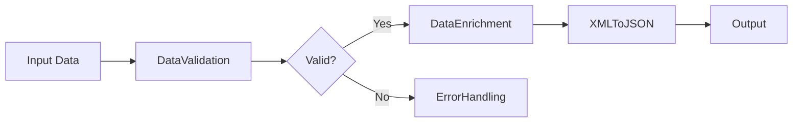
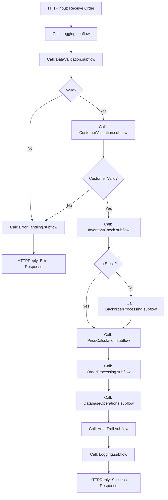

# IBM App Connect Project Structure with Multiple Subflows

## Overview
This guide provides best practices for organizing IBM App Connect projects with multiple subflows, ensuring maintainability, reusability, and scalability.

---

## Recommended Project Structure

```
MyAppConnectProject/
├── Applications/
│   ├── MainApplication/
│   │   ├── Flows/
│   │   │   ├── CustomerOrderFlow.msgflow
│   │   │   ├── InventoryManagementFlow.msgflow
│   │   │   └── PaymentProcessingFlow.msgflow
│   │   └── Resources/
│   │       ├── mappings/
│   │       └── schemas/
│   └── IntegrationApplication/
│       └── Flows/
│           ├── SAPIntegrationFlow.msgflow
│           └── SalesforceIntegrationFlow.msgflow
├── Libraries/
│   ├── CommonSubflows/
│   │   ├── ErrorHandling.subflow
│   │   ├── Logging.subflow
│   │   └── AuditTrail.subflow
│   ├── DataTransformation/
│   │   ├── XMLToJSON.subflow
│   │   ├── JSONToXML.subflow
│   │   ├── DataEnrichment.subflow
│   │   └── DataValidation.subflow
│   ├── BusinessLogic/
│   │   ├── CustomerValidation.subflow
│   │   ├── PriceCalculation.subflow
│   │   ├── InventoryCheck.subflow
│   │   └── OrderProcessing.subflow
│   └── ExternalIntegrations/
│       ├── DatabaseOperations.subflow
│       ├── RESTAPICall.subflow
│       ├── SOAPServiceCall.subflow
│       └── MQOperations.subflow
├── SharedResources/
│   ├── Schemas/
│   │   ├── Customer.xsd
│   │   ├── Order.xsd
│   │   └── Product.xsd
│   ├── Maps/
│   │   └── transformations/
│   └── Policies/
│       └── security/
└── Documentation/
    ├── Architecture.md
    ├── SubflowCatalog.md
    └── DependencyMatrix.md
```

---

## Project Structure Breakdown

### 1. Applications Folder
Contains main message flows that orchestrate business processes.

**Purpose:**
- Entry points for integration scenarios
- Orchestrate calls to subflows
- Handle high-level business logic

**Example:**
```
CustomerOrderFlow.msgflow
├── HTTPInput (receive order)
├── Call ErrorHandling.subflow
├── Call CustomerValidation.subflow
├── Call InventoryCheck.subflow
├── Call PriceCalculation.subflow
├── Call OrderProcessing.subflow
└── HTTPReply (send response)
```

### 2. Libraries Folder
Contains reusable subflows organized by category.

#### a) CommonSubflows
**Purpose:** Cross-cutting concerns used by all flows

**Subflows:**
- [`ErrorHandling.subflow`](#) - Centralized error handling and logging
- [`Logging.subflow`](#) - Standardized logging mechanism
- [`AuditTrail.subflow`](#) - Audit trail creation for compliance

**Input/Output:**
```
ErrorHandling.subflow
├── Input: ErrorCode, ErrorMessage, OriginalMessage
└── Output: FormattedError, LogEntry
```

#### b) DataTransformation
**Purpose:** Data format conversions and transformations

**Subflows:**
- [`XMLToJSON.subflow`](#) - Convert XML to JSON format
- [`JSONToXML.subflow`](#) - Convert JSON to XML format
- [`DataEnrichment.subflow`](#) - Add additional data from external sources
- [`DataValidation.subflow`](#) - Validate data against business rules

**Example Flow:**


#### c) BusinessLogic
**Purpose:** Reusable business rules and calculations

**Subflows:**
- [`CustomerValidation.subflow`](#) - Validate customer data and status
- [`PriceCalculation.subflow`](#) - Calculate prices with discounts and taxes
- [`InventoryCheck.subflow`](#) - Check product availability
- [`OrderProcessing.subflow`](#) - Process order creation and updates

**Dependencies:**
```
PriceCalculation.subflow
├── Calls: DataValidation.subflow
├── Calls: DatabaseOperations.subflow
└── Returns: CalculatedPrice, TaxAmount, Discount
```

#### d) ExternalIntegrations
**Purpose:** Interactions with external systems

**Subflows:**
- [`DatabaseOperations.subflow`](#) - CRUD operations on databases
- [`RESTAPICall.subflow`](#) - Generic REST API invocation
- [`SOAPServiceCall.subflow`](#) - SOAP web service calls
- [`MQOperations.subflow`](#) - IBM MQ message operations

---

## Naming Conventions

### Subflow Naming
Follow this pattern: `[Category][Action][Entity].subflow`

**Examples:**
- `ValidateCustomerData.subflow`
- `TransformOrderToJSON.subflow`
- `CallPaymentGatewayAPI.subflow`
- `LogAuditEvent.subflow`

### Flow Naming
Follow this pattern: `[BusinessProcess][Flow].msgflow`

**Examples:**
- `CustomerOrderFlow.msgflow`
- `InventoryManagementFlow.msgflow`
- `PaymentProcessingFlow.msgflow`

### Terminal Naming
- Input terminals: `In`, `Request`, `Input`
- Output terminals: `Out`, `Success`, `Response`
- Error terminals: `Error`, `Failure`, `Exception`

---

## Subflow Design Principles

### 1. Single Responsibility
Each subflow should have ONE clear purpose.

**Good:**
- `ValidateCustomerEmail.subflow` - validates email format
- `CheckCustomerCredit.subflow` - checks credit status

**Bad:**
- `ProcessCustomer.subflow` - does validation, credit check, and database update

### 2. Input/Output Contract
Define clear input and output parameters.

**Example:**
```
CustomerValidation.subflow
Inputs:
  - CustomerID (String)
  - CustomerData (JSON)
Outputs:
  - ValidationResult (Boolean)
  - ValidationErrors (Array)
  - EnrichedCustomerData (JSON)
```

### 3. Error Handling
Every subflow should handle errors gracefully.

**Pattern:**
```
Subflow Logic
├── Try Block
│   └── Business Logic
└── Catch Block
    ├── Log Error
    ├── Call ErrorHandling.subflow
    └── Return Error Response
```

### 4. Reusability
Design subflows to be used in multiple contexts.

**Tips:**
- Avoid hardcoded values
- Use properties for configuration
- Make dependencies explicit
- Document assumptions

---

## Dependency Management

### Dependency Matrix Example

| Subflow | Depends On | Used By |
|---------|-----------|---------|
| ErrorHandling.subflow | Logging.subflow | All flows |
| CustomerValidation.subflow | DataValidation.subflow, DatabaseOperations.subflow | CustomerOrderFlow, CustomerUpdateFlow |
| PriceCalculation.subflow | DatabaseOperations.subflow | CustomerOrderFlow, QuoteGenerationFlow |
| DataEnrichment.subflow | RESTAPICall.subflow, DatabaseOperations.subflow | Multiple flows |

### Avoiding Circular Dependencies

**Bad:**
```
SubflowA calls SubflowB
SubflowB calls SubflowC
SubflowC calls SubflowA  ❌ Circular dependency
```

**Good:**
```
SubflowA calls SubflowB
SubflowB calls SubflowC
SubflowC calls CommonUtility  ✓ Linear dependency
```

---

## Configuration Management

### Using Properties Files
Store configuration in properties files for flexibility.

**Structure:**
```
Properties/
├── dev.properties
├── test.properties
└── prod.properties
```

**Example Properties:**
```properties
# Database Configuration
db.host=localhost
db.port=5432
db.name=appconnect_db

# API Endpoints
api.customer.url=https://api.example.com/customers
api.payment.url=https://api.example.com/payments

# Timeouts
timeout.database=30
timeout.api=60
```

### Referencing in Subflows
Use User Defined Properties (UDP) to reference configuration.

```
{UserDefinedProperties}:db.host
{UserDefinedProperties}:api.customer.url
```

---

## Testing Strategy

### Unit Testing Subflows
Test each subflow independently.

**Approach:**
1. Create test flows that call individual subflows
2. Provide mock input data
3. Verify output against expected results
4. Test error scenarios

### Integration Testing
Test flows with multiple subflows.

**Approach:**
1. Test complete business scenarios
2. Verify subflow interactions
3. Test error propagation
4. Validate end-to-end functionality

---

## Version Control Best Practices

### Repository Structure
```
git-repo/
├── src/
│   ├── Applications/
│   └── Libraries/
├── config/
│   └── properties/
├── docs/
└── tests/
```

### Branching Strategy
- `main` - Production-ready code
- `develop` - Integration branch
- `feature/subflow-name` - Feature branches
- `hotfix/issue-description` - Hotfix branches

### Commit Messages
```
feat: Add CustomerValidation subflow
fix: Correct error handling in PriceCalculation
refactor: Optimize DatabaseOperations subflow
docs: Update subflow catalog
```

---

## Documentation Requirements

### Subflow Catalog
Maintain a catalog of all subflows.

**Template:**
```markdown
## SubflowName.subflow

**Purpose:** Brief description

**Category:** BusinessLogic | DataTransformation | ExternalIntegrations | CommonSubflows

**Inputs:**
- Parameter1 (Type): Description
- Parameter2 (Type): Description

**Outputs:**
- Result1 (Type): Description
- Result2 (Type): Description

**Dependencies:**
- SubflowA
- SubflowB

**Used By:**
- FlowX
- FlowY

**Error Handling:**
Description of error scenarios and handling

**Example Usage:**
Code or diagram showing typical usage
```

---

## Performance Considerations

### Subflow Optimization Tips

1. **Minimize Subflow Calls**
   - Combine related operations when possible
   - Avoid excessive nesting

2. **Efficient Data Passing**
   - Pass only necessary data
   - Avoid large message copies

3. **Caching Strategy**
   - Cache frequently accessed data
   - Use shared variables wisely

4. **Parallel Processing**
   - Use Fan-Out/Fan-In patterns where applicable
   - Leverage asynchronous processing

---

## Migration and Deployment

### Deployment Checklist
- [ ] All subflows tested independently
- [ ] Integration tests passed
- [ ] Configuration files updated
- [ ] Documentation updated
- [ ] Dependencies verified
- [ ] Performance benchmarks met
- [ ] Security review completed
- [ ] Backup of current version created

### Deployment Order
1. Deploy shared libraries first
2. Deploy common subflows
3. Deploy specialized subflows
4. Deploy main flows
5. Verify connectivity and configuration

---

## Example: Complete Flow with Multiple Subflows



---

## Best Practices Summary

1. **Organize by Function** - Group related subflows together
2. **Clear Naming** - Use descriptive, consistent names
3. **Single Responsibility** - One purpose per subflow
4. **Document Everything** - Maintain comprehensive documentation
5. **Version Control** - Track all changes
6. **Test Thoroughly** - Unit and integration tests
7. **Handle Errors** - Implement robust error handling
8. **Optimize Performance** - Monitor and optimize
9. **Manage Dependencies** - Keep dependencies clear and minimal
10. **Reuse Wisely** - Balance reusability with complexity

---

## Additional Resources

- IBM App Connect Enterprise Documentation
- Message Flow Design Patterns
- Integration Best Practices
- Performance Tuning Guide

---

## Conclusion

A well-structured IBM App Connect project with properly organized subflows leads to:
- **Maintainability** - Easy to update and fix
- **Reusability** - Reduce duplication
- **Scalability** - Easy to extend
- **Testability** - Easier to test components
- **Collaboration** - Team members can work independently

Follow these guidelines to create robust, maintainable integration solutions.